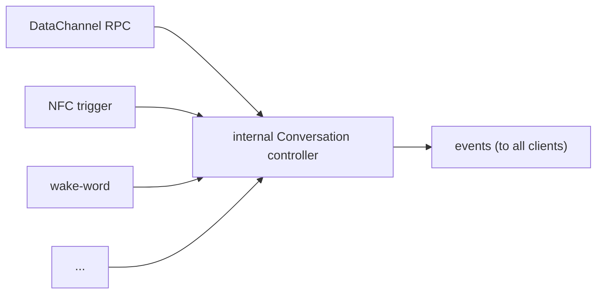

# Conversation - design notes

Status: draft / design proposal.

Internal companion to [`conversation-public-api.md`](./conversation-public-api.md).
The public doc is the **contract** a client codes against (RPC, events,
config, error codes). This doc is **how the pieces work on the robot** and
the invariants behind them - implementation detail a DataChannel client
never needs, but a daemon contributor does.

When in doubt: anything a client sends or receives belongs in the public
API doc; anything that only the runtime/daemon does belongs here.

**Scope.** Some sections below describe direction beyond the first shipping
cut (see "Scope (v1 vs later)" in the public doc). They are marked *(later)*
so they read as exploration, not commitment: **MCP / `tool-spaces` remote
tools** (the local tool registry is v1), and the **NFC "character card"**
trigger-to-config idea (the controller/adapter split itself is v1).

---

## Overview

Read this section alone for the runtime model; the rest of the document is the
precise reference behind it. Everything here is restated, in full, further down -
so you can stop at the end of this Overview and still hold a correct mental model
of how the robot runs a conversation.

**Motion composes in two layers, fused every control tick.** A *primary* layer
plays one thing at a time - recorded animations (emotions, dances) plus idle
breathing - and is the only layer that moves the antennas. A *secondary* layer
adds continuous offsets on top: `wobble` (head sway reacting to speech) and `gaze`
(face-tracking). The two are summed and clamped to the head's reachable envelope.
Two invariants keep it sane: the secondary yields to expressive primaries (gaze
blends out while an emotion or dance plays, so face-tracking never fights a
choreography), and the fused pose is always bounded, so stacking behaviors
degrades gracefully instead of overdriving the actuators. In `config`, animations
are triggered clips while `wobble` and `gaze` are independent continuous
behaviors layered over them.

**Assets are referenced, not embedded.** Animations and sounds live in one
Hugging Face dataset, referenced by name in `config.assets`. A `manifest.json` at
the dataset root maps each textual key to a typed entry (`sound`, `motion`,
`motion_sound`, with room for more kinds later). The `config` only ever references
keys; the runtime looks each up, plays it by its `kind`, caches content-addressed
across sessions, and skips a missing one with a non-fatal error rather than
failing the session.

**Tools run through the runtime, never the client.** `config.tools` names entries
in the robot's tool registry - a fixed set of daemon-integrated, hardware-facing
tools in v1, with MCP/remote tool-spaces as the later extension path. The runtime
orchestrates every call: it routes it, bounds it with a timeout, returns a failure
the model can recover from, and cancels anything still in flight on `interrupt` or
`stop` (late results are dropped silently). The client only ever observes, through
informational `conversation.tool` events - it never drives or unblocks a call.

**Discovery is out-of-band.** The protocol consumes references but never lists
them. That job belongs to the backend API, which is both the catalog clients pick
from and the moderation buffer over third-party content (curated tool-spaces, not
raw Space ids). The robot is the final validator: on `start` it resolves every
name against its actual registry/manifest and degrades unknown ones, so a catalog
that has drifted from a given robot never breaks a session.

**One controller, many triggers.** A DataChannel `start`/`stop` is just one
adapter over an internal conversation controller. On-robot triggers (NFC,
wake-word) call that same controller directly, events broadcast to all clients
regardless of origin, and a `stop` always wins whoever sends it. Each adapter owns
its own trigger semantics (NFC is a presence/level signal, wake-word an edge) and
must resolve a `config` before starting.

---

## Motion & embodiment

Several motion sources share the same actuators (head, antennas, body) and
compose in **two layers**, fused into a single command per control tick:

- **Primary - sequential, exclusive.** Recorded `animations` (emotions,
  dances) plus idle breathing. One at a time; each drives head, antennas and
  body. This is the only layer that moves the **antennas** - there is no
  separate antenna behavior to configure.
- **Secondary - additive, continuous.** `wobble` (TTS-reactive head sway)
  and `vision.gaze` (face-tracking) are offsets summed on top of the current
  primary head pose. They never touch the antennas.

So in `config`, `animations` are triggered clips, while `wobble` and
`vision.gaze` are independent continuous behaviors layered over them - not
part of an animation.

Two invariants keep the layering sane:

- **Secondary yields to expressive primaries.** While an emotion or dance
  plays, `gaze` is suppressed (blended out) so face-tracking does not fight
  the choreography, and resumes when the move ends. `wobble` stays - it only
  reacts to speech the move may carry. Idle breathing is not expressive:
  gaze tracks through it.
- **The fused pose is bounded.** Primary + secondary offsets are clamped to
  the reachable head envelope, so stacking a large emotion with gaze and
  wobble degrades gracefully instead of overdriving the actuators.

> **Impl (conv app):** wobble in `audio/head_wobbler.py` (+ `audio/speech_tapper.py`);
> the primary/secondary fusion, idle breathing and `set_listening` live in
> `moves.py` (`compose_world_offset`); clips via `dance_emotion_moves.py` and
> `tools/{dance,play_emotion,move_head,idle_do_nothing}.py`; gaze via
> `camera_worker.py` + `vision/head_tracking/`.

---

## Assets

Animations and sounds are not embedded in the API - they live in a single
**asset dataset** on the Hugging Face Hub, referenced by name
(`config.assets`). The dataset is a flat bank of files plus a
`manifest.json` mapping a **textual key** to a **typed entry**:

```jsonc
// manifest.json at the dataset root
{
  "hmm":   { "kind": "sound",        "audio": "sounds/hmm.wav" },
  "uh":    { "kind": "sound",        "audio": "sounds/uh.wav" },
  "happy": { "kind": "motion_sound", "move": "moves/happy.json", "audio": "moves/happy.wav" },
  "spin":  { "kind": "motion",       "move": "moves/spin.json" }
}
```

Kinds today: `sound` (standalone clip), `motion` (recorded move), and
`motion_sound` (a move with a linked clip - the existing
`<name>.json` + `<name>.wav` convention). New kinds (`image`, `led`, ...)
can be added without touching the API: the manifest is the catalog, config
just references keys.

- **Resolution.** Asset keys in `config` (`animations.*`, `sounds.*`) are
  looked up in the manifest; the runtime plays each entry by its `kind`.
  (`config.tools` is separate - see Tools.)
- **Caching.** Reuses the Hub mechanism (`snapshot_download`, preloaded at
  daemon boot). The cache is content-addressed and cross-session - a pure
  latency optimization, not state (the dataset name is the reference).
- **Warm-up.** A non-default `assets` dataset is fetched during `starting`;
  fillers are warmed before `running` so the first one is instant.
- **Missing entry degrades.** An unknown key or a download miss skips that
  asset and emits a non-fatal `conversation.error`.

> **Impl (conv app):** moves are pulled from the HF Hub via the SDK today
> (`tools/play_emotion.py` -> `RecordedMoves("pollen-robotics/reachy-mini-emotions-library")`,
> `tools/dance.py` -> dances library), and `vision/local_vision.py` uses
> `snapshot_download`. There is no `manifest.json` catalog or sounds bank yet.

---

## Tools

`config.tools` lists what the model may call, by name, from the robot's
**tool registry**. The runtime orchestrates every call - the model asks,
the runtime routes it and returns the result. The DataChannel client never
executes a tool, so `conversation.tool` events are informational only.

Tools come in two kinds, distinguished by **where they run**:

- **Daemon-integrated (local).** A **fixed set** of built-in Python tools
  shipped with the runtime, acting on robot hardware (`move_head`,
  `play_emotion`, `dance`, `look`, ...). This set is *not* user-extensible:
  there is no drop-in directory for your own Python tools - adding a capability
  beyond it is what MCP is for.
- **MCP (remote)** *(later, not v1)*. Discovered and invoked on remote MCP
  servers - in practice Hugging Face Spaces installed as tool sources via the
  `tool-spaces` mechanism. They run on the Space; the robot is just the MCP
  client. This is the **only** way to extend the model beyond the built-in set,
  used for third-party capabilities (e.g. Home Assistant), not robot motion.
  It is a phase-2 subsystem; v1 ships the built-in tools only, and MCP is
  designed now so `config.tools` stays uniform when it lands.

Either way the API treats them uniformly: a name in `config.tools` the
model may call.

**`config.tools` vs `config.animations` / `config.sounds`.** They are
orthogonal: `tools` enables a *verb*, `animations` / `sounds` scope the
*clips* a motion/sound verb may reach. At resolve time the runtime ANDs the
two - the `play_emotion` / `dance` tools select only from the resolved
`animations` repertoire (empty -> the robot's full default set for that verb),
and a clip listed without its tool enabled is never reachable. So the asset
lists never grant a capability on their own; they only narrow one a tool in
`config.tools` already exposes.

MCP tools especially are never raw Space ids from a client: they come from a
curated, moderated catalog (see Discovery).

**Failure and latency are the runtime's problem, not the client's.** Every
call is bounded by a timeout; on error or timeout the runtime returns a
failure result to the model (which can recover or apologise in-turn) and
emits a non-fatal `conversation.error` for observability. A slow remote MCP
tool never blocks the conversation indefinitely - it is cancelled and the
turn proceeds. The `conversation.tool` event stays informational: the
DataChannel client neither drives nor unblocks tool execution.

**In-flight calls are cancelled on `interrupt` and `stop`.** A barge-in
(`interrupt`) or an `stop` cancels any tool still running for the current
turn; where the underlying tool supports cancellation it is actively stopped,
otherwise the runtime simply abandons it. Either way a result that lands after
cancellation - or after the timeout fired - is **dropped silently**: it is too
late to feed the model, so it never reaches the turn and is not re-emitted on
`conversation.tool`. The runtime only emits the `error` phase for that call's
cancellation/timeout (tagged with `reason: cancelled` / `timeout`), never a
stale `done`.

> **Impl (conv app):** the registry is `tools/core_tools.py` (`ALL_TOOLS` /
> `ALL_TOOL_SPECS`, loaded from `tools/*.py` + `profiles/*/tools.txt`), with
> async execution in `tools/background_tool_manager.py`. Today's code also has
> an internal external-tools loader (`AUTOLOAD_EXTERNAL_TOOLS` /
> `TOOLS_DIRECTORY`), but it is *not* an exposed authoring path.
>
> The MCP / `tool-spaces` remote-tool path described above is no longer just
> *(later)*: a working prototype already landed, built by **Alina**
> (`@alozowski`) in #322 - and it is genuinely nice work. It splits cleanly
> into `mcp_client.py` (an async, HTTPS-only client for remote MCP servers,
> with name-namespacing, timeout handling that unwraps `ExceptionGroup`s, and
> collision detection - no third-party Python is ever downloaded or executed)
> and `tool_spaces.py` (install / list / remove of public **Gradio** Spaces as
> tool sources, validated to public-only, then wired into `core_tools.py` and
> `profiles/*/tools.txt`). It is well-tested (`test_mcp_client*.py`,
> `test_tool_spaces.py`, `test_tool_space_runtime.py`) and already matches the
> uniform `config.tools` shape this doc designs for.

---

## Discovery

The API **consumes references, it does not enumerate them**. `config` names
tools, a `voice`, an `assets` dataset, personas - but nothing in the
protocol lists what is available. That is deliberate: discovery is the
client's job, resolved out-of-band against the Reachy Mini backend API (the
same one it uses for auth), and kept off the control-only DataChannel.

- **The backend API is the catalog.** It returns descriptors (name, label,
  description, args schema where relevant) the client renders into pickers,
  then writes the chosen names into `config`. It is also the **moderation
  buffer** over third-party content - curated MCP tool-spaces are served from
  here, never raw Space ids from a client (App Store / Apple compliance).
- **The robot is the validator.** Discovery is advisory. On `start` the robot
  resolves every name against its actual registry / manifest and **degrades
  unknown references** (skips and reports them), so a catalog that drifts from
  a given robot never breaks a session.

> **Impl (conv app):** discovery is REST today - `personality_routes.py`
> (`/personalities`, `/voices`) over `personality.py`, with static voice
> catalogs in `config.py`. There is no backend moderation buffer yet.

---

## External triggers

`start`/`stop` over the DataChannel are a thin remote adapter over an
**internal controller** (`start(config)` / `stop()` / `restart(config)` /
`status()`). Any number of **trigger adapters** call that same controller -
the DataChannel is just one. On-robot examples: an **NFC trigger** (tag
approaches -> start, tag leaves -> stop) and a **wake-word** listener
("dis Reachy" -> start). `restart(config)` is the controller's atomic
stop-then-start: it keeps the audio lock held across the swap, so the same
physical-trigger precedence as `start` applies (a remote `restart` over an
NFC/wake-word session is refused with `robot_busy`).



- **Single controller, many adapters.** On-robot adapters (NFC, wake-word)
  call the controller directly, never round-tripping through the remote
  RPC. Events broadcast regardless of origin, so a remote UI sees a
  locally-triggered conversation like any other.
- **Origin is explicit and open.** `conversation.phase` carries `origin.by`
  (`rpc` | `nfc` | `wakeword` | ...); a new trigger extends the set without
  any other change.
- **Trigger semantics are the adapter's job.** Each adapter owns how it
  fires, then calls `start`. NFC is a level signal (presence, with flicker
  -> debounce/hysteresis for "stays connected"); wake-word is an edge (a
  one-shot phrase). An always-listening adapter also owns the mic while
  idle and hands it over on start. The API stays edge-based and unaware of
  any of this.
- **`stop` always wins**, whoever sends it - a safety escape hatch. An
  adapter only (re)starts on a fresh trigger edge (a new `start`, a tag
  re-presented, a new wake-word), never on continuous presence - so a human
  `stop` is not immediately undone.

**Open question - trigger -> config** *(later, exploratory).* Each adapter
must resolve a config before calling `start`. A wake-word can use a
configured default persona; an NFC tag should *carry a config reference*
(assets dataset + persona) - a physical "character card" resolved like a
remote `start`. Resolving an opaque tag id via a lookup table reintroduces
state and is deferred. The controller/adapter split is v1; the specific
adapters (NFC, wake-word) and this character-card idea are not.

> **Impl (conv app):** no external triggers exist today - NFC, wake-word and
> any non-client start are absent; conversations are started from the UI only.
