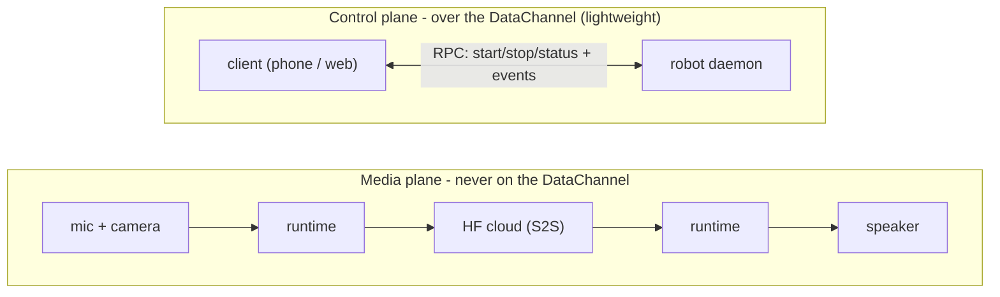
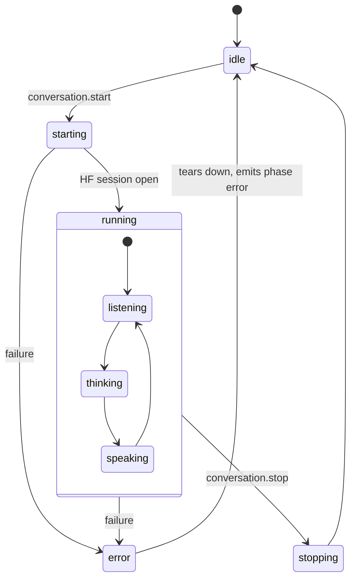

# Conversation - overview

Status: draft / design proposal.

> This is an early draft and reflects only my own opinion on the subject - not a settled decision. The most interesting part is probably the [public API](./conversation-public-api.md).

This is the landing page for the on-robot **conversation** system. It frames
the whole design and points you at the right detailed doc; the two companion
documents are the precise reference behind it.

A conversation is a speech-to-speech (S2S) session that runs on the robot,
backed by Hugging Face. By default the robot plays its replies out loud -
embodiment stays on the device - while a client (mobile or web) drives and
observes the session over a WebRTC DataChannel that carries control and
lightweight events, never audio.

---

## Which doc do I read?

Two documents, split by audience. The rule that decides where a thing lives:
**anything a client sends or receives is the contract; anything only the
runtime/daemon does is design.**

| Doc | It answers | Read it if you are... |
|---|---|---|
| [`conversation-public-api.md`](./conversation-public-api.md) | The **client contract**: what you call (RPC), what you receive (events), the `config` you hand in, and the error codes you branch on. | building or extending a client (mobile, web, CLI) that drives/observes a conversation. |
| [`conversation-design.md`](./conversation-design.md) | **How the pieces work on the robot**: motion fusion, the asset manifest, the tool registry, discovery, on-robot triggers - and the invariants behind them. | a daemon contributor working on the runtime itself. |

If you only read one thing, read the **Overview** section of whichever doc
matches you: each is written to be self-contained, so you can stop at the end
of it and still hold a correct mental model.

---

## The shared mental model

A single narrative across both docs. Each point is a thread you can pull on in
the detailed docs.

**One small control surface.** A client talks to the robot through one
namespace, `conversation.*`, over the DataChannel: six RPCs (`start`, `stop`,
`restart`, `status`, `say`, `interrupt`) and a handful of one-way events (`phase`, `turn`,
`transcript`, `level`, `tool`, `metrics`, `error`). The channel carries control
only - audio never rides it. *(Public API: RPC, Events.)*

**One config, fixed at start.** Every expressive choice - prompt, voice, tools,
language, animations, sounds, gaze, wobble, audio route - is an optional field of a single
`config` object handed to `start`. There is no *hot* reconfigure: a different
config needs a fresh session - an explicit `stop` then `start`, or a single
atomic `restart` that swaps the config without releasing the audio lock or
flickering back to `idle` (and doubles as a "start over" button). The robot
fills unset fields from its defaults and echoes the fully-resolved config back
on `conversation.phase`.
*(Public API: Config.)*

**A clear lifecycle.** A session moves `idle -> starting -> running ->
stopping`, observed on `conversation.phase`. `error` is transient, not a parking
state: on a fatal failure the runtime tears itself down and settles back to
`idle`, so a retry is just another `start`. The fine-grained turn-states a UI
animates (`listening`, `thinking`, `speaking`) live *inside* `running` and are
reported separately on `conversation.turn`. *(Public API: State model.)*

**References, resolved out-of-band.** Names in `config` (`tools`, `voice`,
`assets`, `animations`, `sounds`) are *not* enumerated by the protocol. The
client discovers them from the backend catalog and writes the chosen names in;
the robot is the final validator and **degrades** unknown ones rather than
failing the session. The effect is forward/backward compatibility. *(Design:
Assets, Tools, Discovery.)*

**One owner, the robot in charge.** Only one conversation runs at a time,
guarded by an exclusive audio lock. Control is gated behind a **single Hugging
Face account**, so there is exactly one logical driver - no multi-tenant
arbitration. Events broadcast to every connected transport because one human may
watch from phone *and* web. Losing the connection never stops the session; a
reconnecting client just calls `status` to resync. *(Public API: Connection &
ownership.)*

**Motion composes in two layers.** A *primary* layer plays one thing at a time
(recorded animations + idle breathing) and is the only layer that moves the
antennas; a *secondary* layer adds continuous offsets on top (`wobble`,
`gaze`). The two are summed and clamped to the head's reachable envelope, and
the secondary yields to expressive primaries so face-tracking never fights a
choreography. *(Design: Motion & embodiment.)*

**Tools run through the runtime, never the client.** `config.tools` names
entries in the robot's tool registry; the runtime routes every call, bounds it
with a timeout, returns recoverable failures to the model, and cancels anything
in flight on `interrupt`/`stop`. The client only ever observes, through
informational `conversation.tool` events. *(Design: Tools.)*

**Many ways to start.** A DataChannel `start` is just one adapter over an
internal conversation controller. On-robot triggers (wake-word, NFC) call the
same controller directly, so a client may observe a `running` session it never
launched; `conversation.phase.origin.by` records which trigger fired. A `stop`
always wins whoever sends it. *(Design: External triggers.)*

**Audio can move to the client.** By default mic and speaker stay on the robot
(`local`, fully embodied). `mic_client` uses a cleaner client mic while the
robot still speaks out loud. `remote` ("call your robot from afar") plays on the
client and freezes embodiment - it is a later mode. *(Public API: Audio
routes.)*

**A stateless contract.** The *protocol* carries no persistent state: the full
`config` is supplied on every `start`, and the state of record lives with the
client. The runtime is of course stateful while `running`; what is stateless is
the contract, not the device. Long-term memory is a separate subsystem keyed to
the HF account, outside this contract. *(Public API: Memory.)*

---

## Scope (v1 vs later)

This contract is intentionally **broader than the first shipping cut**. Because
every `config` field is optional and reference-based, later capabilities slot in
**without a protocol change**, and an older robot simply ignores what it does
not know. This split is the single source of truth - the detailed docs mark the
same items *(later)* where they appear.

- **v1 core.** `start` / `stop` / `restart` / `status` / `say` / `interrupt`; the `phase`
  and `turn` events, transcripts and level; `local` audio; daemon-integrated
  tools; `prompt` / `voice` / `animations` / `gaze` / `wobble`.
- **Designed, not v1 (may change).** The `remote` audio route and its "call your
  robot from afar" product mode; MCP / `tool-spaces` remote tools; NFC "character
  card" configs. Treat these as direction, not a commitment.

> Note: the MCP / `tool-spaces` remote-tool path is further along than the v1
> split implies - a working prototype already landed (see the impl note under
> Tools in [`conversation-design.md`](./conversation-design.md)).

---

## The two planes

The client only ever touches the control plane; media rides separate WebRTC
tracks and never the DataChannel.

The robot always holds the HF session and the cloud leg. By default (the
`local` route) mic, camera and speaker all stay on the robot. Mic and speaker
can optionally move to the client (`mic_client`, `remote`), but always over
dedicated WebRTC media tracks - audio never crosses the DataChannel. The camera
always stays on the robot (local face-tracking never leaves the device).

## The lifecycle at a glance

Phases: `idle`, `starting`, `running`, `stopping`, `error`. The three
turn-states (`listening` / `thinking` / `speaking`) only exist *inside*
`running` and are reported by `conversation.turn`.

---

## Read next

- **[`conversation-public-api.md`](./conversation-public-api.md)** - the client
  contract: RPC, events, config, audio routes, error codes.
- **[`conversation-design.md`](./conversation-design.md)** - the runtime design:
  motion, assets, tools, discovery, external triggers.
