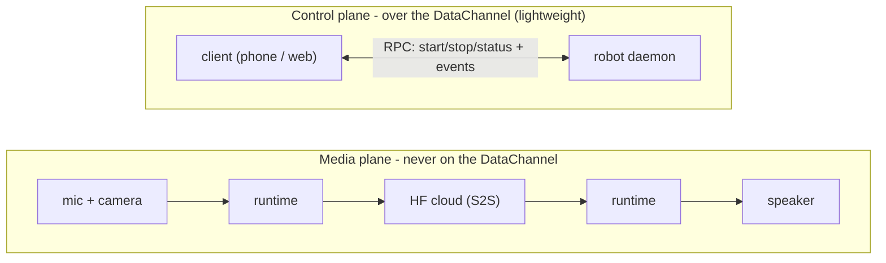
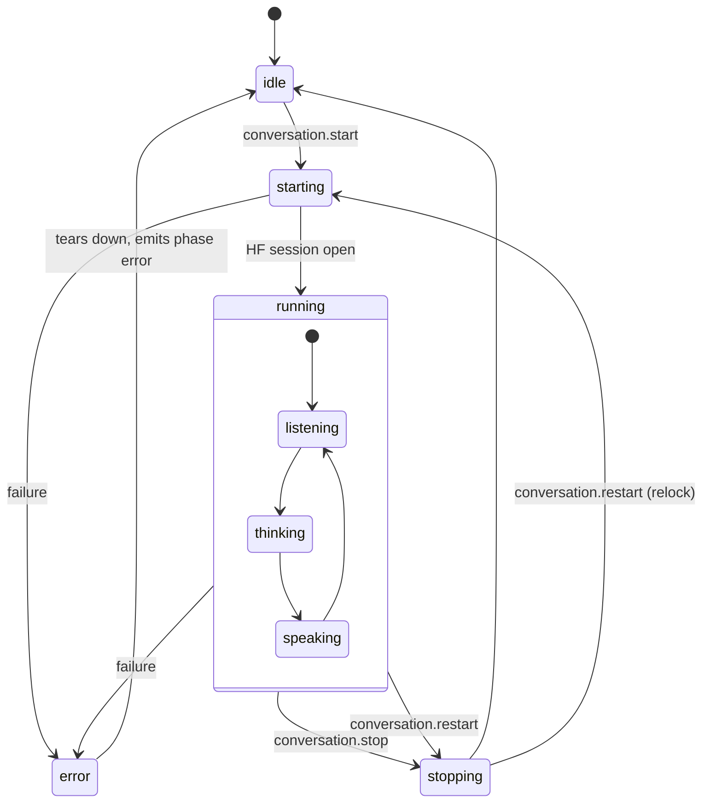

# Conversation public API

Status: draft / design proposal.

How the on-robot conversation is exposed. The backend is Hugging Face only
and, by default, the robot plays its replies out loud (embodiment stays on
the device). A client (mobile or web) drives and observes it over the WebRTC
DataChannel, which carries control and lightweight events, never audio. Mic
and speaker can optionally move to the client over separate WebRTC media
tracks (see Audio routes).

This doc is the **client contract**: what you call, what you receive, and the
guarantees behind it. How those pieces work on the robot - motion fusion, the
asset manifest, the tool registry, discovery, on-robot triggers - lives in the
companion [`conversation-design.md`](./conversation-design.md).

---

## Overview

Read this section alone to understand the whole contract; the rest of the
document is the precise reference behind it. Everything here is restated, in
full, further down - so you can stop at the end of this Overview and still hold a
correct mental model.

**The shape.** A client (mobile or web) talks to the robot through one namespace,
`conversation.*`, over the WebRTC DataChannel. It is a small surface: six RPCs
(`start`, `stop`, `restart`, `status`, `say`, `interrupt`) and a handful of one-way events
(`phase`, `turn`, `transcript`, `level`, `tool`, `metrics`, `error`). The channel
carries control only - audio never rides it. Mic, speaker and camera stay on the
robot; when audio moves to the client it travels on separate WebRTC media tracks.

**The lifecycle.** A session moves `idle -> starting -> running -> stopping`, and
the client observes every transition on `conversation.phase`. `error` is *not* a
parking state: on a fatal failure the runtime tears itself down, emits
`phase: error`, and settles back to `idle`, so a retry is just another `start`.
The fine-grained turn-states a UI animates - `listening`, `thinking`, `speaking`
- live *inside* `running` and are reported separately on `conversation.turn`.
`start` (and `restart`) block until the cloud session is actually open (or a
server-capped timeout fires). `say` is the opposite - it
returns as soon as the turn is *accepted*, and the spoken result is observed
through events.

**One config, fixed at start.** Every expressive choice - prompt, voice,
language, tools, animations, sounds, gaze, wobble, audio route - is an optional field of a single
`config` object handed to `start`. There is no *hot* reconfigure (you never
mutate a live session): re-`start`ing with the same resolved config is a no-op,
and a different config needs a fresh session - either an explicit `stop` then
`start`, or a single atomic `restart` that swaps the config without releasing
the audio lock or flickering back to `idle`. The robot fills unset fields from
its defaults and echoes the fully-resolved config back in `conversation.phase`.

**References, resolved out-of-band.** Names you put in `config` (`tools`,
`voice`, `assets`, `animations`, `sounds`) are *not* enumerated by the protocol.
The client discovers them from the backend catalog and writes the chosen names in.
Both kinds of unknown input degrade rather than fail the session: an unknown
*reference* is skipped and reported, an unknown *config field* is ignored and
falls back to its default. The effect is forward/backward compatibility - a newer
client never breaks against an older robot.

**One owner, the robot in charge.** Only one conversation runs at a time, guarded
by an exclusive audio lock (`robot_busy` if it is already held). Control is gated
behind a **single Hugging Face account** - the OAuth identity the robot is paired
to, also used for the conversation backend and memory - so there is exactly one
logical driver. This is not a multi-tenant system: events broadcast to every
connected transport because one human may watch from phone *and* web, not because
there are several principals, so there is no preemption or cross-user arbitration
to design for. Losing the connection never stops the session; a reconnecting
client just calls `status` to resync.

**Many ways to start.** A DataChannel `start` is only one trigger. The robot can
also start itself (wake-word, NFC), so a client may observe a `running` session it
never launched. `conversation.phase.origin.by` records which trigger fired.

**Audio can move to the client.** By default mic and speaker stay on the robot
(`local`, fully embodied). `mic_client` uses a cleaner client mic while the robot
still speaks out loud. `remote` ("call your robot from afar") plays on the client
and freezes embodiment - it is a later mode.

**A stateless contract.** The *protocol* carries no persistent state: the full
`config` is supplied on every `start`, and the state of record lives with the
client. The runtime is of course stateful while `running` (audio lock, phase,
`session_id`); what is stateless is the contract, not the device. Long-term memory
is a separate subsystem keyed to the HF account, outside this contract.

**Broader than v1, on purpose.** This contract is intentionally larger than the
first shipping cut. Because every field is optional and reference-based, later
capabilities (`remote` audio, MCP tools, NFC configs) slot in without a protocol
change, and an older robot simply ignores what it does not know. Those parts are
marked *(later)* where they appear; see Scope for the v1 / later split.

---

## Scope (v1 vs later)

This contract is deliberately broader than the first shipping target. The
config is reference-based and every field optional, so later capabilities
slot in **without a protocol change** - documenting them now keeps the
surface forward-compatible. To set expectations:

- **v1 core.** `start` / `stop` / `restart` / `status` / `say` / `interrupt`; the
  `phase` and `turn` events, transcripts and level; `local` audio;
  daemon-integrated tools; `prompt` / `voice` / `language` / `animations` /
  `gaze` / `wobble`.
- **Designed, not v1 (may change).** The `remote` audio route and its
  "call your robot from afar" product mode; MCP / `tool-spaces` remote
  tools; NFC "character card" configs. Treat these as direction, not a
  commitment - they are marked *(later)* where they appear.

---

## Built for agents

A design goal, not an afterthought: an LLM agent should be able to extend both
sides of this system from these docs alone, with no bespoke SDK.

- **Authoring clients.** The surface is small and uniform - six RPCs, a few
  one-way events, one reference-based `config`. An agent can build an app that
  drives and observes a conversation (mobile, web, CLI) without learning
  per-feature endpoints - coding directly against the protocol, or leaning on
  the JavaScript SDK where it speeds things up.
- **Authoring tools.** The built-in Python tools shipped with the runtime are
  a **fixed set**, not an extension point. To give the model a *new* capability
  you expose it as an MCP tool-space on a public **Gradio Space** (Python)
  *(later)*; it then appears in `config.tools` alongside the built-ins, with no
  bespoke SDK. See Tools and Discovery in
  [`conversation-design.md`](./conversation-design.md).

---

## Topology

Two planes, and the client only ever touches one:



The robot always holds the HF session and the cloud leg. By default (the
`local` route) mic, camera and speaker all stay on the robot. Mic and speaker
can optionally move to the client (`mic_client`, `remote` - see Audio routes),
but always over dedicated WebRTC media tracks, never the DataChannel. Gaze is
shorter still: the camera always stays on the robot, feeding a local
face-tracking loop that drives head motion and never leaves the device.

> **Impl (conv app):** transport differs today - control is REST + SSE
> (`console.py`, `ConversationEventBus`) and media is a binary WebSocket
> `/ws/audio` (`static/js/audio-bridge.js`), not a WebRTC DataChannel. The
> local face-tracking loop exists (`camera_worker.py`, `vision/head_tracking/`).

---

## Two message families

The wire format is **JSON-RPC 2.0** (the same base protocol as MCP, which the
runtime already speaks), split into two families:

- **RPC** - request/response, correlated by `id`. Lifecycle and control.
- **Events** - JSON-RPC **notifications** (a `method` with no `id`), pushed
  one-way from the robot and never answered. Observability.

So a message carries `id` (an RPC, expecting a response) or omits it (an event
notification), never both. **One deviation from the spec:** the stable string
error codes the UI branches on live in `error.data.reason` (JSON-RPC reserves
`error.code` for integers - see Error codes).

RPC, `phase`, `turn`, final transcripts, `tool` and `error` ride a **reliable,
ordered** channel: delivered exactly once, in send order - `error` especially,
so a `fatal` failure the client must branch on is never silently dropped. The
high-rate, loss-tolerant stream (`level`, partial transcripts, `metrics`) rides
a **separate unreliable** channel, so a late envelope never blocks control. There is no per-event
sequence number and no replay buffer - on reconnect a client resyncs with
`conversation.status` (the phase snapshot is the source of truth) and
resumes following live events from there. Events emitted while
disconnected are lost by design, not recovered.

> **Impl (conv app):** today it is REST request/response plus one-way SSE
> (`event: activity`) in `console.py`; there is no `id`-correlated RPC
> envelope.

---

## RPC (client -> robot)

Request - `id` is any client-chosen token, echoed back so the client can
match the reply:

```jsonc
{ "jsonrpc": "2.0", "id": "<token>", "method": "conversation.start", "params": { ... } }
```

Response - success carries `result`, failure carries `error` (discriminated by
which is present, per JSON-RPC; the stable string code is in `error.data.reason`):

```jsonc
{ "jsonrpc": "2.0", "id": "<token>", "result": { ... } }
{ "jsonrpc": "2.0", "id": "<token>", "error": { "code": -32000, "message": "robot busy", "data": { "reason": "robot_busy" } } }
```

### Methods

(`jsonrpc` and `id` omitted below for brevity; every request carries both.)

```jsonc
// Start - resolves once the HF session is open (phase: running), and
// times out to `phase: error` if that open stalls (server-capped).
// Idempotent only for the *same* config: re-starting with an identical
// *resolved* config is a no-op returning the current state; a *different*
// config fails with `already_running` (stop then start to change it).
{ "method": "conversation.start", "params": {
    "config": { /* see Config - all fields optional */ }
}}

// Stop - idempotent (no-op if already idle). Optional session_id guards races.
{ "method": "conversation.stop", "params": { "session_id": "s-abc" } }

// Restart - atomically stop the active session and start a fresh one with a
// (possibly different) config. Blocks like `start` until the new session is
// `running`. NOT idempotent: always a fresh `session_id`, even for an identical
// config (the sanctioned reconfigure / reset path). Like `start` if none runs.
// Optional session_id guards against restarting a session swapped under you.
{ "method": "conversation.restart", "params": {
    "config": { /* see Config - all fields optional */ },
    "session_id": "s-abc"
}}

// Current state - resync after (re)connecting
{ "method": "conversation.status" }

// Runtime - only while running (else `not_running`). Optional session_id
// guards against a session swapped under the client.
{ "method": "conversation.say", "params": { "text": "There's someone at the door.", "session_id": "s-abc" } }
{ "method": "conversation.interrupt", "params": { "session_id": "s-abc" } }
```

At a glance (the prose below is the precise reference behind this table):

| method | params | blocking | resolves with | error codes |
|---|---|---|---|---|
| `conversation.start` | `config` (all fields optional) | yes - held until `running` or `start_timeout` | phase snapshot (`running`) | `already_running`, `robot_busy`, `missing_credentials`, `start_timeout` |
| `conversation.stop` | `session_id?` | no | phase snapshot (`idle`) | - (no-op if already idle) |
| `conversation.restart` | `config` (all fields optional), `session_id?` | yes - held until the new `running` or `start_timeout` | phase snapshot (`running`, fresh `session_id`) | `robot_busy`, `missing_credentials`, `start_timeout` |
| `conversation.status` | - | no | phase snapshot (current) | - |
| `conversation.say` | `text`, `session_id?` | no - returns on *accept* | `result` (turn accepted; spoken result via events) | `not_running` |
| `conversation.interrupt` | `session_id?` | yes - until playback stops | `result` | `not_running` |

`start` / `stop` are the client's whole launch surface: a single call, no
orchestration - the robot takes the audio lock, starts the runtime, and
opens the HF session under the hood. All expressiveness lives in `config`; to
change it, `stop` then `start`, or `restart` to do both in one atomic call.
They are not the only entry point, though: the robot can also start itself
(see Connection & ownership).

**`start` is deliberately blocking.** Its reply is held until the HF session
is actually open (`phase: running`), or until the server-capped `start_timeout`
fires (`phase: error`). It is the one long-running RPC: its `id` correlation
must survive several seconds, and a client should run its own UI timeout in
parallel with the server cap. This is the opposite of `say`, which resolves
with a `result` immediately once the turn is *accepted* and lets the spoken
result be observed through events. The asymmetry is intentional: `start` reports a
reached state, `say` reports an accepted intent.

**What "identical" means - the effective config.** Idempotence is decided on
the **effective config**, never the raw `params`. The effective config is the
deterministic output of the *same* resolution every `start` runs, in this order:

1. **drop** unknown fields, **fill** unset ones from the robot's defaults;
2. **resolve references and drop the ones that degrade** - an unknown `tools` /
   `animations` / `sounds` / `voice` / `assets` reference is removed exactly as
   it is for the live session, so two `start`s that differ only by a reference
   the robot can't resolve are still equal;
3. **normalise to a canonical form** - scalars compared by value; the
   reference lists (`tools`, `animations.*`, `sounds.*`, `sounds.fillers.pool`)
   compared as **sets** (order-insensitive, de-duplicated); object fields
   compared structurally, key order irrelevant.

Two `start`s are **identical iff their effective configs are deep-equal** under
that canonical form. The definition is both testable and observable: the
effective config is *exactly* the object echoed on `conversation.phase`, so a
client can diff what it sent against what the robot returned, and a runtime test
can assert `resolve(a) == resolve(b)`. Concretely, a re-`start` that omits a
field it set last time but resolves to the same default, reorders or duplicates
a `tools` list, or repeats a now-unknown reference, all still count as
identical.

**Precedence** when a `start` arrives while a session is already active.
Equality is checked *first*, so origin only ever picks the error code:

1. **identical effective config → no-op** - returns the current snapshot,
   whatever the active session's origin (a second device can re-`start` the
   same config simply to adopt and observe it);
2. else, if the active session was **RPC-started → `already_running`** - stop
   then start to change the config;
3. else, if it was started by an **on-robot trigger (NFC, wake-word) →
   `robot_busy`** - you cannot reconfigure a physical trigger remotely, so the
   user clears it on the robot first.

A matching config always short-circuits to the no-op before origin is even
consulted. There is no `force`.

**`restart` is the sanctioned reconfigure / reset.** Where `start` on an active
RPC session refuses a *different* config with `already_running`, `restart`
embraces it: it atomically tears the current session down and brings a fresh one
up with the given `config`, holding the audio lock across the swap so no other
trigger can slip in and the session never visibly settles to `idle`. It is the
single-call form of `stop` then `start`, with three differences worth stating:
it is **not idempotent** (it always yields a fresh `session_id`, even for an
identical config - so it doubles as a "start over / clear context" button); if
nothing is running it behaves exactly like `start`; and it still honours the
physical-trigger rule - restarting a session an **on-robot trigger** (NFC,
wake-word) started fails with `robot_busy`, since you cannot reconfigure a
physical trigger remotely (clear it on the robot, or `stop` first). The new
session is always `origin.by: rpc`. There is deliberately no `already_running`
from `restart` - dodging that error is its whole purpose.

There is **one logical driver** by design - the single Hugging Face account the
robot is paired to - never several principals, so there is no preemption and no
cross-user arbitration. The same human may keep more than one transport open at
once (phone *and* web): they all observe, and any of them may issue control
RPCs, but because they are the *same* owner the worst case is a human racing
themselves, not adversarial clients. `stop`-wins and the optional `session_id`
guard make that safe (see Connection & ownership); the daemon does not arbitrate
between distinct users because there are none.

`start` and `status` resolve with the current **phase snapshot** - the exact
same payload as the `conversation.phase` event, including `protocol`,
`session_id`, `phase` and the effective `config`. That is where a client
reads the `session_id` it can later pass to `stop`, and the `protocol`
integer it checks once on connect to detect a version mismatch (bump it on a
breaking `conversation.*` change; no negotiation beyond that). On mismatch
the client refuses to drive and prompts an update.

The RPC reply and the `conversation.phase` event can carry the same phase (a
`result` reply with `phase: running`, plus a `phase: running` event). That is
intentional redundancy, not two competing truths: the **`conversation.phase`
event stream is authoritative**, the RPC reply is just the synchronous snapshot
at resolution time. A client reconciles on the event and assumes no order
between the reply and the event. Likewise a `start` that fails during
`starting` surfaces **once** as the RPC `error` (with `error.data.reason`); the
matching `phase: error` event is that same failure broadcast to every client,
not a second, separate error.

`say` and `interrupt` act on the live session; `session_id` is optional (only
one runs at a time) but, as for `stop`, guards against acting on a session
swapped under the client. Called when not `running`, they fail with
`not_running`.

- **`say`** makes the robot speak now. The runtime injects `text` as an
  assistant turn, barging in if the robot is mid-utterance, then voices it
  through the active voice. **It is not verbatim TTS:** the backend is
  speech-to-speech, so `text` is an *instruction the model voices*, not a
  guaranteed-literal string - it may be rephrased. Do not rely on the exact
  wording; keep scripted lines short and literal, and read the actual output
  back from `conversation.transcript`. It resolves with a `result` as soon as
  the turn is accepted; the spoken result is observed through `conversation.turn` /
  `conversation.transcript` events, not the reply.
- **`interrupt`** is a programmatic barge-in: it cancels the in-flight
  response and clears playback, dropping the robot back to `listening` - the
  same effect as a user cutting in. It also cancels any tool call in flight for
  that turn; a result that lands after cancellation is dropped silently (see
  Tools in [`conversation-design.md`](./conversation-design.md)). No params;
  resolves once playback stops.

> **Impl (conv app):** lifecycle is `conversation_handler.py`
> (`start_up`/`shutdown`) driven by `console.py` (`launch()`/`close()`,
> `GET /status`), not a structured start/stop RPC. Barge-in/`interrupt`
> exists (`base_realtime.py` on `speech_started`, `gemini_live.py`);
> `say` has no equivalent yet.

---

## State model



Phases: `idle`, `starting`, `running`, `stopping`, `error`. The three
turn-states (`listening` / `thinking` / `speaking`) only exist *inside*
`running` and are reported by `conversation.turn`, not `conversation.phase`.

Only one conversation at a time, guaranteed by the robot audio lock.

`restart` walks `running -> stopping -> starting -> running` as one atomic step:
the audio lock is held across the whole swap (never released to another
trigger), so the transient `stopping`/`starting` phases are observed on
`conversation.phase` but the lock is never free and the session never settles to
`idle`. The new `running` carries a fresh `session_id`.

`error` is **transient, not a parking state**. On a fatal failure the runtime
tears itself down - releases the audio lock, closes the HF session - emits
`phase: error`, then settles back to `idle` (with `reason: error`). The
client does nothing to "exit" it: the session is already gone, and a retry is
just another `start`. So `error` never holds the lock hostage.

> **Impl (conv app):** phases live client-side as orb states
> (`static/js/constants.js` `ORB_STATES`, `orb.js`) fed by activity reasons
> from `base_realtime.py`; there is no server-side phase enum.

---

## Typical session

A whole conversation, end to end (RPC requests in, events out):

```jsonc
// RPCs carry an `id`; events are notifications (a `method`, no `id`).
// `jsonrpc: "2.0"` is on every message, omitted here for brevity.

// 1. Resync on connect - robot is idle (result is a full phase snapshot)
->  { "id": "1", "method": "conversation.status" }
<-  { "id": "1", "result": { "protocol": 1, "phase": "idle" } }

// 2. Start
->  { "id": "2", "method": "conversation.start", "params": { "config": { "prompt": "..." } } }
<-  { "method": "conversation.phase", "params": { "phase": "starting", "session_id": "s-abc", ... } }
<-  { "id": "2", "result": { "protocol": 1, "phase": "running", "session_id": "s-abc", ... } }
<-  { "method": "conversation.phase", "params": { "phase": "running", ... } }

// 3. Conversation runs - events stream to every connected client
<-  { "method": "conversation.turn", "params": { "state": "listening" } }
<-  { "method": "conversation.transcript", "params": { "role": "user", "text": "hello", "final": true } }
<-  { "method": "conversation.turn", "params": { "state": "thinking" } }
<-  { "method": "conversation.turn", "params": { "state": "speaking" } }
<-  { "method": "conversation.level", "params": { "rms": 0.42 } }

// 4. Stop
->  { "id": "3", "method": "conversation.stop" }
<-  { "method": "conversation.phase", "params": { "phase": "stopping", ... } }
<-  { "id": "3", "result": { "protocol": 1, "phase": "idle" } }
<-  { "method": "conversation.phase", "params": { "phase": "idle", ... } }
```

A client that connects mid-conversation does the same step 1 and gets
`phase: running` back, then follows the live events - no special replay path.

---

## Events (robot -> all clients)

Events are JSON-RPC notifications: a `method` and a `params` object, no `id`
(`jsonrpc: "2.0"` omitted below for brevity).

```jsonc
// Session lifecycle - source of truth, also returned by conversation.status
{ "method": "conversation.phase", "params": {
  "protocol": 1,                                     // conversation.* protocol version
  "session_id": "s-abc",
  "phase": "idle" | "starting" | "running" | "stopping" | "error",
  "reason": "stop" | "inactivity_timeout" | "start_timeout" | "trigger" | "error" | "...",  // why this phase (open set)
  "origin": { "by": "rpc" | "nfc" | "wakeword" | "...", "tag_id": "..." },  // who started it (open set)
  "config": { /* effective config */ } } }

// Real-time sub-state while running (drives the orb). `speaking` brackets
// actual playback (real start/end of audio out), not generation.
{ "method": "conversation.turn", "params": { "state": "listening" | "thinking" | "speaking",
  "reason": "interrupted" | "..." } }   // on `listening` after a barge-in/`interrupt` (open set)

{ "method": "conversation.level", "params": { "rms": 0.42 } }   // RMS envelope, not audio - ~10 Hz while running
{ "method": "conversation.transcript", "params": { "role": "user" | "assistant", "text": "...", "final": true } }
{ "method": "conversation.tool", "params": { "name": "dance", "args": { ... },
  "call_id": "t-1", "phase": "started" | "done" | "error",
  "reason": "cancelled" | "timeout" | "failed" | "...",  // on `error` only (open set)
  "result": { ... } } }   // informational; one event per phase
{ "method": "conversation.metrics", "params": { "first_audio_ms": 240 } }
{ "method": "conversation.error", "params": { "code": "hf_disconnected", "message": "...", "fatal": true } }  // `fatal: true` also drives phase: error -> idle
```

At a glance (the prose below is the precise reference behind this table):

| event | channel | key fields | when |
|---|---|---|---|
| `conversation.phase` | reliable | `protocol`, `session_id`, `phase`, `reason`, `origin{by,tag_id}`, `config` | every phase transition; source of truth, also returned by `status` |
| `conversation.turn` | reliable | `state` (`listening`/`thinking`/`speaking`), `reason` | turn sub-state change *inside* `running` |
| `conversation.transcript` | reliable (final) / unreliable (partial) | `role`, `text`, `final` | per transcript chunk |
| `conversation.level` | unreliable | `rms` | ~10 Hz while `running`, idle otherwise |
| `conversation.tool` | reliable | `name`, `args`, `call_id`, `phase` (`started`/`done`/`error`), `reason`, `result` | once per tool phase, correlated by `call_id`; informational |
| `conversation.metrics` | unreliable | e.g. `first_audio_ms` | occasional telemetry, when a measurement lands |
| `conversation.error` | reliable | `code`, `message`, `fatal` | on error; `fatal: true` also drives `phase: error -> idle` |

`conversation.phase` answers "does the session exist, in what life state";
`conversation.turn` answers "what is the robot doing right now". They are
separate so the UI can show a connecting spinner and a listening orb
independently. `origin.by` records *who* started the session, `reason` records
*why* the current phase was entered; they answer different questions and vary
independently. `reason` is advisory (an open set) - it lets the UI tell an
inactivity stop from a fatal one without branching on error codes.
`conversation.turn`'s `speaking` is bounded by *actual playback*: it begins
when audio starts coming out and ends when the playback tail truly finishes,
so the orb and embodiment track real speech, not generation. A barge-in or
`interrupt` ends the turn early back to `listening` with `reason: "interrupted"`;
in `remote` audio that transition is the cue for the client to flush any
buffered assistant audio it has not played yet, while in `local` the robot just
clears its own playback. `conversation.level` is an envelope for the orb, not
audio; expect it at roughly 10 Hz while `running` and idle otherwise.
`conversation.metrics` is
occasional telemetry (e.g. `first_audio_ms`), emitted when a measurement lands
rather than on a fixed schedule. `conversation.tool` fires once per `phase`
(`started`, then `done` or `error`) correlated by `call_id`, so a UI can show a
tool running and then its outcome; it stays informational - the client never
drives or unblocks the call. On the `error` phase it also carries an advisory
`reason` (open set: `cancelled` / `timeout` / `failed`) so the UI can tell a
barge-in/`interrupt` cancellation from a genuine tool failure and not alarm the
user on a normal interruption. `conversation.error` carries an explicit `fatal`
boolean (see Error codes): the client branches on that, not on whether a
`phase` event happens to follow.

> **Impl (conv app):** `console.py` `ConversationEventBus` + `GET /conversation_events`
> (SSE activity) carry the turn/tool reasons emitted by `base_realtime.py`
> `_mark_activity`. Transcripts, the RMS level and metrics stay server-side
> today and are not pushed to clients.

---

## Config

The single extension point. Every field is optional; the robot fills the
rest from its defaults, and echoes the fully-resolved config back in
`conversation.phase`. (The snippet below uses doc conventions: `"a" | "b"`
lists the allowed values of one field, it is not literal JSON.)

```jsonc
{
  // Personality & language
  "prompt": "You are a friendly desk robot...",  // system prompt
  "voice": "...",                                 // TTS voice id
  "language": "en",                               // ISO 639-1; soft start hint (transcription + prompt). Not a lock - the user can switch language mid-conversation

  // Asset bank - keys below resolve through its manifest (see conversation-design.md)
  "assets": "pollen-robotics/reachy-mini-assets",

  // What the model may call - names from the tool registry (see conversation-design.md)
  "tools": ["move_head", "play_emotion", "dance", "look"],
  "animations": {
    "emotions": ["happy", "curious", "sad"],
    "dances": ["wiggle", "spin"]
  },

  // Sounds - keys into the asset manifest
  "sounds": {
    "fillers": {                                  // latency-masking "tics"
      "enabled": true,
      "trigger_after_ms": 400,                    // play only if thinking outlasts this
      "pool": ["hmm", "uh", "tongue_click"]
    },
    "cues": ["greeting", "ack", "confirm"]        // model-triggerable
  },

  "wobble": { "enabled": true, "gain": 1.0 },     // TTS-reactive head wobble
  "vision": {
    "gaze": { "enabled": true },                  // local face-tracking -> head motion (no cloud)
    "model_input": "off"                          // "off" | "on_demand" (model snapshots via the look tool)
  },
  "vad": { "silence_ms": 500 },                   // turn-taking
  "inactivity_timeout_ms": 120000,                // auto-stop after silence (server-capped; reset by any user/assistant turn or `say`)
  "audio": "local" | "mic_client" | "remote"     // where mic/speaker live (default: local; `remote` is later) - see Audio routes
}
```

Both unknown inputs degrade rather than fail `start`, so a newer client never
breaks against an older robot:

- An unknown **config field** (a schema-level typo, or a field from a newer
  protocol) is ignored: the robot falls back to its default and keeps the
  fields it does recognise, then reports the skipped field via a non-fatal
  `conversation.error` for observability.
- An unknown **reference** (a `tools` / `animations` / `sounds` key with no
  match in the registry or manifest) degrades the same way: that one entry is
  skipped and reported, the conversation still runs.

**`tools` and `animations` are two different axes - they combine with AND.**
`tools` is the set of *verbs* the model may invoke; `animations` is the
*repertoire* the motion verbs draw from. The motion tools (`play_emotion`,
`dance`) only fire clips listed in `animations.emotions` / `animations.dances`:

- a motion tool enabled in `tools` but with an **empty** matching `animations`
  list falls back to the robot's full default repertoire for that verb;
- an `animations` clip whose **tool is absent** from `tools` is inert - it is
  listed but nothing can trigger it.

The same split holds for sounds: `sounds.cues` is the repertoire of
model-triggerable clips, gated by whether the cue-playing tool is enabled.
So `animations` / `sounds` never *add* a capability on their own; they only
scope the clips a tool already enabled in `tools` may reach.

The names you put in `tools` / `voice` / `assets` / `animations` / `sounds`
are not enumerated by this API. Resolve them out-of-band against the backend
catalog (the same backend used for auth), then write the chosen names into
`config`; the robot validates them on `start` and degrades unknown ones (see
Discovery in [`conversation-design.md`](./conversation-design.md)).

On language, `language` is a **soft start hint, not a lock**. It only sets the
expected language at the start of a session: it biases the **input
transcription** (an ISO 639-1 code such as `"en"` / `"fr"`) so the transcriber
does not drift on short or accented utterances, and it can seed the `prompt`.
But the conversation is never pinned to it - the backend is speech-to-speech and
hears the raw audio, so the **user can switch language mid-conversation** and
the model follows (and mirrors it back, since the spoken language is ultimately
driven by the `prompt`, not this field). The only effect of being off-hint is a
slightly less accurate input transcript until the user settles; the spoken
exchange still works. `language` defaults to `"en"` and, like every field,
degrades silently if unset or unknown.

On vision: `gaze` is a local face-tracking loop (camera -> head motion) that
never reaches the cloud - pure embodiment. It runs in `local` and
`mic_client` (the robot is speaking out loud) and freezes in `remote` (see
Audio routes). `model_input: "on_demand"` lets the model take a snapshot via
the look tool; continuous streaming is out of scope for now. There is no
separate "camera on" signal: whether the camera is active is read from the
effective `config` echoed in `conversation.phase`.

> **Impl (conv app):** config is spread across env (`config.py`), packaged
> profiles (`personality.py` + `profiles/*/{instructions,tools,voice}.txt`),
> `prompts.py` and `startup_settings.py` - no single JSON schema. Motion is
> enabled via tools, not config fields; a sounds/fillers pipeline does not
> exist yet. `language` already exists at the session level - the realtime
> session sets `audio.input.transcription.language` - but the on-robot app
> hardcodes it to `"en"` (`huggingface_realtime.py`), while the mobile app
> already wires it from a user preference (`transcriptionLanguage`).

---

## Audio routes

The robot always holds the HF session and the cloud leg; `config.audio` only
moves where the mic and speaker physically live. Audio travels on dedicated
WebRTC media tracks, never the DataChannel. Three closed routes - no free
mic/speaker toggles, because only these combinations make sense:

| route | mic | speaker | use |
|---|---|---|---|
| `local` (default) | robot | robot | nominal, fully embodied |
| `mic_client` | client | robot | better mic / push-to-talk near the robot; robot still speaks out loud |
| `remote` *(later)* | client | client | "call your robot" from afar; the body is inert |

- **`mic_client`** trades a little input latency (an extra client -> robot
  hop) for a cleaner mic when the room is noisy or the robot is across the
  room. The robot still speaks out loud, and the *acoustic echo of the robot's
  own voice is the hard part*: the client mic picks that voice up from the
  room, but the speaker it would have to cancel against lives on the robot, not
  the client - there is no local reference signal for a textbook AEC.
  Suppressing it needs the robot's playback signal shared back as a reference
  (or echo suppression on the cloud S2S leg). Treat it as non-trivial, not free.
- **`remote`** *(later, not v1)* is a different product mode: the reply
  plays on the client, so nobody hears the robot in the room and
  **embodiment is inert** (`wobble` and `gaze` freeze - there is no local
  listener to perform for). It adds a hop on both legs (client -> robot ->
  cloud -> robot -> client) and the client owns full-duplex echo
  cancellation. Because the client now plays the audio, it must flush its
  buffer on a `conversation.turn` `reason: "interrupted"` (the barge-in cue),
  or it keeps playing the tail of a cut-off sentence.

> **Impl (conv app):** `console.py` `record_loop`/`play_loop` + `GET /audio/mode`
> switch between robot and browser sinks (`static/js/audio-bridge.js`); mic
> gating via `conversation_handler.py` `_mic_muted`. No `remote` route.

---

## Error codes

Errors surface on two channels, by *when* they happen. A failure **before**
the session reaches `running` (bad config, no lock, no token) comes back as the
RPC `error` response to the call that caused it (the stable string in
`error.data.reason`, since JSON-RPC's `error.code` is a reserved integer). A
failure **after** `running` (the cloud drops, an asset misses) cannot ride a
reply - the call already resolved - so it arrives as a `conversation.error`
event carrying an explicit `fatal` boolean: `fatal: true` tears the session
down and also drives `phase: error -> idle`; `fatal: false` is a non-blocking
degrade (a skipped asset, a tool timeout) the session survives. The client
branches on `fatal`, never on whether a `phase` event happens to follow. Same
`reason` vocabulary on both channels.

Stable `reason` values (carried in `error.data.reason` on an RPC error, and as
`code` on a `conversation.error` event) the UI can branch on:

| `code` | When | Expected UI reaction |
|---|---|---|
| `robot_busy` | a conversation started **on the robot** (NFC, wake-word) holds the audio lock - a physical trigger can't be reconfigured remotely (also from `restart`) | tell the user to clear the trigger / stop it on the robot |
| `missing_credentials` | no HF token on the robot | surface it; HF auth is handled out-of-band |
| `already_running` | an **RPC-started** session is active and `start` carries a *different* resolved config (same config is a no-op) | `restart` to reconfigure atomically, or `stop` then `start` |
| `not_running` | `say` / `interrupt` while no session is running | ignore, or prompt to start first |
| `start_timeout` | the HF session did not open in time during `starting` (drives `phase: error`) | banner + auto-retry |
| `hf_disconnected` | the cloud session dropped mid-conversation | banner + auto-retry |

> **Impl (conv app):** errors are ad-hoc REST strings today (`console.py`,
> `personality_routes.py`, e.g. `empty_key`, `profile_locked`); the stable
> named codes above (`robot_busy`, `missing_credentials`, ...) don't exist yet.

---

## Connection & ownership

Once `running`, the session belongs to the robot, not to whoever started
it. A control client is an observer.

- **The client isn't the only trigger.** A session can also start on the
  robot itself (NFC tag, wake-word), so a client may see a `running` session
  it never started. `conversation.phase` carries `origin.by` (`rpc` | `nfc` |
  `wakeword` | ...) to tell which; the client treats a `running` session
  uniformly whatever its origin. The trigger mechanism lives in
  [`conversation-design.md`](./conversation-design.md).
- **Disconnect never stops.** Losing the DataChannel does not end the
  conversation - audio is local, and an NFC-held or "phone in pocket"
  session must survive. A reconnecting client calls `conversation.status`.
- **Bounded, not leased.** No heartbeat ties the session to a client. It ends
  on one of four things: an explicit `stop`, an adapter (e.g. an NFC tag
  leaving), a fatal error, or `inactivity_timeout_ms`. That last one is a
  silence window: any user/assistant turn or `say` resets it, and the server
  caps it so a session can never stay alive forever and burn HF credit. The
  effective cap is echoed back in the `config`.
- **One account, one owner.** The daemon's transport is authenticated against a
  **single Hugging Face account** - the OAuth identity the robot is paired to,
  the same one used for the conversation backend and for memory. There is no
  multi-user mode: every connected transport is that same person. So "multiple
  clients" only ever means *one human on several devices*, never distinct
  principals; the broadcast of events is a convenience for that, not a
  multi-tenant feature. Tighter limits (per-device pairing, quotas) are a
  platform concern.
- **Stop authority (light).** Any of that owner's connected transports may
  `stop`; an optional `session_id` avoids stopping a newer session in a race.
  Because they share one identity, concurrent control RPCs are a human racing
  themselves (rare, self-inflicted), not contention to arbitrate.

> **Impl (conv app):** `console.py` `_browser_audio_lock` only guards the
> browser audio sinks, not robot ownership; there is no session lock today.

---

## Memory

The conversation **protocol** transports no memory: each session starts from the
`config` it is handed (see Stateless protocol in the TL;DR). This is a statement
about the *contract*, not behaviour - the runtime is **not** memoryless, it reads
memory (below). Long-term memory is a **separate daemon subsystem**, not part of
this contract - so it needs nothing new in the API. The runtime reads it
(a curated index folded into the `prompt` at `start`, plus read-only recall
tools the model calls mid-turn, surfaced like any other tool in
`conversation.tool`); writing happens out-of-band in a background
consolidation pass over past sessions, never on the live turn. The store
and its privacy controls live with that subsystem. One candidate store is a
**per-user private HF dataset** (same infra as `assets` and auth): memory is
keyed to the HF account, not the device - so the robot stays stateless and
the memory follows the user across robots, with per-robot write sharding to
avoid conflicts. Treat it as *(later)*; see
[`reachy_mini_conversation_app/docs/memory-system-design.md`](https://github.com/pollen-robotics/reachy_mini_conversation_app/blob/main/docs/memory-system-design.md)
for a concrete implementation.
