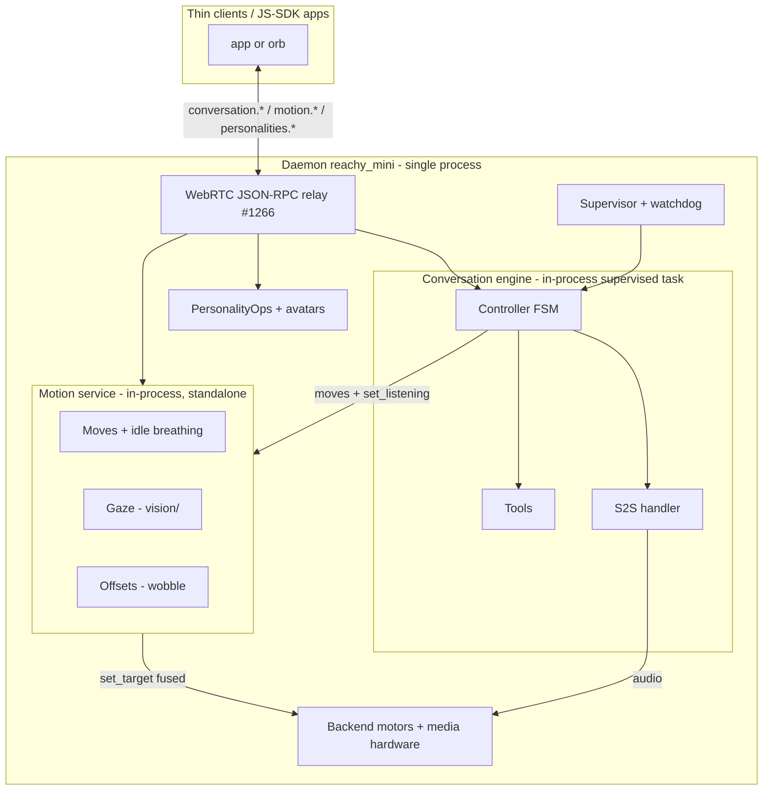

# Conversation service - design breakdown

Status: draft / design proposal.

This folder is the **shared discussion base** for the on-robot conversation
service and its embodiment layer. It is organised around the **public interface**
of each block (the `conversation.*` / `motion.*` / `personalities.*` surfaces, the
`config` schema, the model-facing tools), so the docs describe WHAT each block
exposes and the decisions that frame it, not the internal wiring.

A separate set of client-contract docs (overview / public API / design) defines
the exact wire contract; when it lands it will be linked from here.

## Goal

Turn the conversation from a store app (separate subprocess, cold start, REST +
SSE) into a **first-class in-process service of the daemon**, kept warm, exposed
through the stable `conversation.*` protocol. Port the solid parts of the current
app, drop the debt. The embodiment (`MovementManager`) becomes a **standalone
daemon capability** exposed over WebRTC so any client or JS-SDK app can drive the
robot's body, with the conversation as just one consumer.

## Core architecture decision: in-process

The engine runs **in-process** in the daemon (a supervised asyncio task), not in
a separate subprocess. Rationale:

- Once the `MovementManager` moves to the daemon, the engine is glue (cloud WS +
  audio + motion calls + tools). Nothing safety-critical drives motors from it.
- The only native crash source is GStreamer, which the daemon already hosts.
- No large sudden allocation in scope (vision is cloud, no local model), so a
  memory watchdog plus bounded queues covers gradual leaks.
- A separate process would pay its cost where it hurts (two-owner audio hardware
  coordination, cross-process `set_listening` latency) for a theoretical gain.
- Recent precedent: #1268 removed the face tracker's process boundary and runs it
  as a niced daemon thread ([`../../../src/reachy_mini/vision/face_tracking.py`](../../../src/reachy_mini/vision/face_tracking.py)).

Rule: a **heavy local model** (future on-device vision) gets its own process. The
conversation engine does not.

Two more settled behaviors (full detail in [`07-lifecycle-and-supervision.md`](./07-lifecycle-and-supervision.md)):

- **Dormant until a trigger.** Nothing runs by default; a session (and the lazy
  motion service) starts only on a client trigger (`conversation.start`) or a robot
  trigger (NFC/wake-word, later). `start` wakes the robot, `stop` sleeps it.
- **One owner, arbitrated by `robot_app_lock`.** Conversation OR store app OR
  remote session, never two. The conversation takes a transport-independent holder
  so it survives client disconnect.

## Components (one doc per block)

Each doc is scoped to the **public interface** of its block (the RPC / events /
config / tools it exposes and consumes), plus the few decisions that frame it.
Implementation notes, PR1 scope and open questions are kept short and local.

| Block | Doc | Public interface |
|---|---|---|
| Conversation engine | [`01-conversation-engine.md`](./01-conversation-engine.md) | `conversation.*` (RPC + events), the controller FSM, and the audio I/O path |
| Motion service | [`02-motion-service.md`](./02-motion-service.md) | `motion.*` - standalone embodiment over WebRTC |
| Vision | [`03-vision.md`](./03-vision.md) | Camera fan-out + face/head tracking - **already in the daemon**, we reuse it |
| Tools | [`04-tools.md`](./04-tools.md) | The model-facing verbs + execution contract |
| Memory | [`05-memory.md`](./05-memory.md) | `save_memory` / `recall_memory`, logging + prompt injection |
| Personas & config | [`06-personas-and-config.md`](./06-personas-and-config.md) | `personalities.*` / `voices.*` + the `config` schema they resolve into |
| Lifecycle & supervision | [`07-lifecycle-and-supervision.md`](./07-lifecycle-and-supervision.md) | Warm supervision, robot lock, wake/sleep, auth, crash surfacing, inactivity |
| Testing | [`08-testing.md`](./08-testing.md) | Contract/conformance tests + the WebRTC harness |

## A note on levels ("service" vs "engine")

Two things share the word but sit at different levels:

- **The conversation service** is this whole thing - the umbrella capability the
  daemon hosts (engine + tools + memory + personas/config + lifecycle).
- The **conversation engine** ([`01-conversation-engine.md`](./01-conversation-engine.md))
  is its runtime **core** (the controller FSM + S2S handler), not the whole service.
- The **motion service** ([`02-motion-service.md`](./02-motion-service.md)) is a
  **standalone** capability that lives *beside* the engine and is usable with no
  conversation at all.

So over the relay `conversation.*` and `motion.*` look like two peer namespaces,
but internally the engine is the heart of the conversation service while motion is
a reusable capability it happens to consume.

## Namespaces exposed over WebRTC

All ride the existing JSON-RPC-2.0-over-WebRTC relay (#1266, "Expose the apps
control API over WebRTC"), never a bespoke transport:

- `conversation.*` - session lifecycle and control.
- `motion.*` - standalone embodiment (usable without any conversation session).
- `personalities.*` / `voices.*` - discovery and CRUD.

Events (`conversation.phase` / `turn` / `transcript` / `level`) fan out to every
connected transport via `broadcast_to_all_clients`.

## System view

## PR1 - tracer bullet v1

Minimal but real: `conversation.start` makes the robot talk, move and call a
tool; `stop` / `say` / `interrupt` work; `motion.*` is drivable standalone
(no session). See each block doc for its PR1 scope.

## Roadmap (after PR1)

1. Pure in-process media (single GStreamer pipeline, PCM tap).
2. Full `motion.*` surface (raw target/goto, gaze tuning) + third-party apps.
3. (Optional) S2S session pre-warm/pool, only if the `starting` animation is not enough.
4. Full `config` + atomic `restart` + effective-config idempotence.
5. `tool` / `metrics` / `error` events + error taxonomy.
6. MCP tool-spaces, asset manifest, NFC/wake-word triggers, offline degraded mode.
7. Memory extensions (vector recall, sleep-time compute, `forget_memory`) - see [`05-memory.md`](./05-memory.md).
8. Reference JS thin client + removal of the REST + SSE / :7860 transport.

## Open questions

Collected from the block docs so discussion stays in one place:

- **Motion**: exact minimal `motion.*` surface vs what the JS SDK already exposes;
  concurrency policy when a client drives `motion.*` during an active conversation
  (v1: last writer wins).
- **Engine**: whether `restart` must be atomic in v1; how much of the app's
  weighted `idle_policy` to keep vs defer.
- **Lifecycle**: the exact `robot_app_lock` extension shape for the
  transport-independent conversation holder; watchdog thresholds on the target CM4
  RAM size.
- **Audio**: whether to invest early in the single-pipeline PCM tap if the
  two-owner handshake proves fragile on hardware.
- **Config**: how strict canonicalization / idempotence needs to be in PR1.
- **Personas**: where an eventual backend catalog (moderation buffer for
  third-party content) fits vs on-robot personas.
