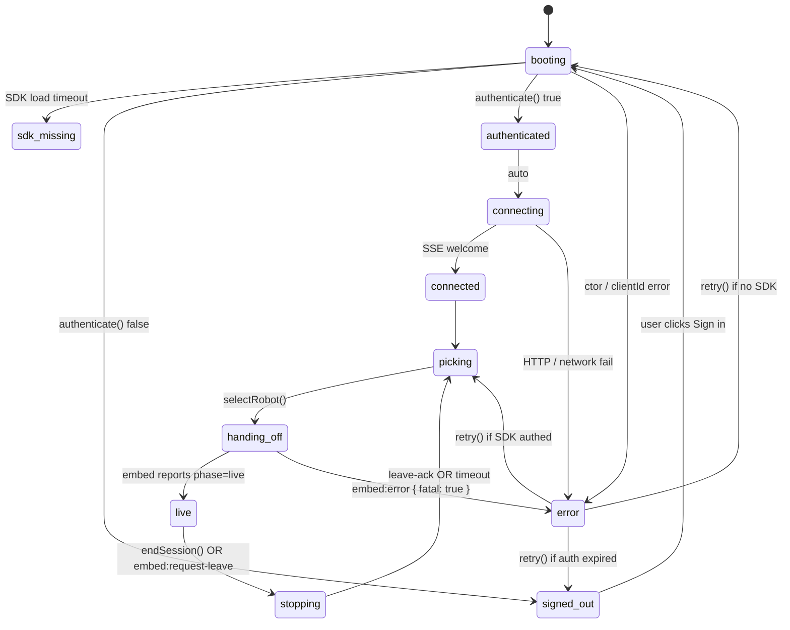
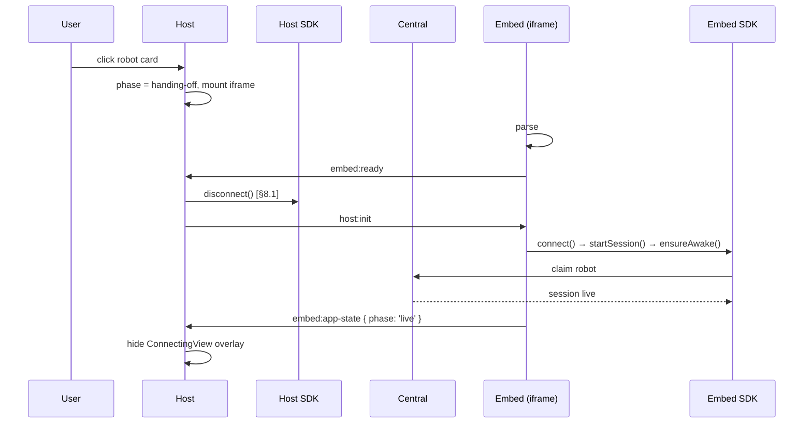

# Reachy Mini app boot spec

| Spec version | Status     | Last updated |
|--------------|------------|--------------|
| 1.0          | Active     | 2026-05-16   |

Source-of-truth for what a Reachy Mini app must do at boot, what
`@pollen-robotics/reachy-mini-sdk/host` does for it, and the contract between the
shell, the embed and the app code.

This file describes **observable behaviour and invariants**. The
wire format lives in [`src/lib/protocol.ts`](./src/lib/protocol.ts).
The README is a tour for first-time integrators.

> **Read this in 15 minutes**: §1-§5 are the integration contract,
> §6 is the protocol, §7 is two state diagrams, §8 lists the
> non-negotiable invariants. §9-§11 are appendices.

## Table of contents

1. [Roles](#1-roles)
2. [Two boot modes, one URL surface](#2-two-boot-modes-one-url-surface)
3. [Mode A: Hub standalone flow](#3-mode-a-hub-standalone-flow)
4. [Mode B: Mobile handoff flow](#4-mode-b-mobile-handoff-flow)
5. [App-author contract](#5-app-author-contract)
6. [Protocol v1](#6-protocol-v1)
7. [State machines](#7-state-machines)
8. [Engineering invariants](#8-engineering-invariants)
9. [Non-goals](#9-non-goals)
10. [Threat model](#10-threat-model)
11. [Backlog](#11-backlog)

## How to evolve this spec

- §1-§7 describe the **current implementation**: update them as the
  code changes, in the same PR.
- §8 lists **hard invariants**: every PR that touches the bridge or
  the FSM must keep them green or update them explicitly with a
  CHANGELOG entry.
- §11 is the **backlog**: graduate items into §8 only when they are
  implemented and the cost of regressing them is real.

---

## 1. Roles

Three actors, one app repository:

| Actor      | Lives in                          | Owns                                                                       |
|------------|-----------------------------------|----------------------------------------------------------------------------|
| **App**    | `index.html` + `src/dispatch.ts`  | UI, app-specific UX, **and full freedom over framework / tooling choices** |
| **Host**   | `@pollen-robotics/reachy-mini-sdk/host/auto` (CDN)    | OAuth, robot discovery, robot picker, connecting overlay, end-session flow |
| **Embed**  | `@pollen-robotics/reachy-mini-sdk/host/embed` (CDN)   | SDK lifecycle inside the iframe (`startSession`, `ensureAwake`, teardown)  |

The **App** consumes:

- the Reachy Mini SDK (loaded as a CDN module by `index.html`,
  exposed as `window.ReachyMini`),
- the `@pollen-robotics/reachy-mini-sdk/host` package (npm dep for types, CDN entries
  at runtime).

The App contains zero auth code, zero picker code, zero
session-lifecycle code.

### App identity: `owner/space`

A Reachy Mini app is **uniquely identified by its Hugging Face
Space ID**, of the form `owner/space` (e.g. `pollen-robotics/emotions`).
Everything downstream of identity flows from this single string:

- The catalog API filters and dedupes apps by `space.id`.
- The mobile app stores and recalls "last opened" apps by `owner/space`.
- The host shell does **not** need this ID at runtime (it lives
  inside the app it renders); it's used solely by the discovery
  surface (catalog API + mobile).

### Official vs community apps

An app is **official** if and only if its Space ID starts with
`pollen-robotics/`. There is no allowlist, no separate registry,
no `official: true` field anywhere. Adding `pollen-robotics/` to
your URL is the entire qualification.

Where the distinction surfaces:

| Surface              | Behaviour                                                       |
|----------------------|-----------------------------------------------------------------|
| Mobile catalog       | "Official" badge / sort priority on `pollen-robotics/*` Spaces  |
| Website `/api/js-apps` | Returns `isOfficial: true` for `pollen-robotics/*`              |
| Host shell           | **No notion of "official"**. Renders the app the same way always |

This is a non-decision at the host level: the host doesn't know,
doesn't care. Keep it that way.

### Tech freedom is a core design principle

The iframe boundary is intentional: it lets an app pick **any
framework, any bundler, any styling system** without the host
caring. The reference apps prove this in practice:

| Reference app                       | Stack                       | Demonstrates                                  |
|-------------------------------------|-----------------------------|-----------------------------------------------|
| `reachy_mini_emotions`              | React 19 + MUI 7 + Vite     | A typed React app with rich UI components     |
| `reachy_mini_telepresence`          | React 19 + MUI 7 + Vite     | An app that uses media streams + camera UI    |
| `reachy_mini_minimal_conversation`  | **Vanilla TS + Vite**       | Zero-framework app, ~few KB runtime overhead  |

If you add a new app, you do **not** need to consult the host
team about your stack. The only contract is: render in the
iframe, talk to the host through `connectToHost()`, ship the 4
files in §5.

### Why React + MUI for the host (and only the host)

The host shell (`@pollen-robotics/reachy-mini-sdk/host/auto`) is built with **React +
MUI + Emotion**. This is an explicit, assumed choice:

- The shell needs a real component library: forms (sign-in),
  lists (picker), overlays (connecting / leaving), top bar, dark
  mode toggles. Hand-rolling these in vanilla would slow us down
  with no benefit to app authors.
- The shell renders only **outside the iframe** and only between
  sessions; once an app is live, the shell's bundle is idle.
- App authors who chose a different framework still load the
  shell React+MUI bundle for sign-in/picker UI. This is the cost
  of the iframe model and we accept it (see §9 Non-goals).

The trade-off favours **fast host iteration + tech freedom for
apps** over a slimmer host shell. A vanilla micro-shell remains
possible if usage data ever justifies it (§11 backlog).

---

## 2. Two boot modes, one URL surface

The same `index.html` is served for both modes. The dispatcher
(`src/dispatch.ts`) picks between them based on the URL.

| Mode                  | URL shape                                                            | What happens                                         |
|-----------------------|----------------------------------------------------------------------|------------------------------------------------------|
| **A. Hub standalone** | `https://<space>.hf.space/`                                          | Full host shell (OAuth → picker → iframe with app)   |
| **B. Mobile handoff** | `https://<space>.hf.space/?embedded=1#creds=<base64(CredsBundle)>`      | Skip shell; app boots directly, creds come via hash  |

### Dispatch rule

```
if (URL.searchParams.has("embedded") && URL.hash.startsWith("#creds=")):
    boot embed  -> import("./embed")
else:
    boot host   -> import("@pollen-robotics/reachy-mini-sdk/host/auto").mountHost({...})
```

`?embedded=1` without creds is an invalid mode - render `ErrorView`.

### `CredsBundle` (lives only in the URL hash, never in search)

The full shape lives in `src/lib/protocol.ts` (`CredsBundle`).
Key field: `hfToken` is a short-lived HF bearer (see §8.3). The
hash is never sent to a server; the embed wipes it with
`history.replaceState` on the very first synchronous tick, before
any `await`.

---

## 3. Mode A: Hub standalone flow

The user lands on `https://<space>.hf.space/` from anywhere
(direct link, HF Space gallery, etc.).

### 3.1 Boot → auth → picker

Phase machine inside `useReachyHost`:

```
booting → (signed-out | authenticated) → connecting → connected → picking
```

- **`booting`**: wait for `window.ReachyMini`, instantiate the SDK,
  call `instance.authenticate()`.
- **`signed-out`**: render `SignInView` with a "Continue with
  Hugging Face" button that starts an OAuth redirect.
- **`authenticated`** → `connecting` → `connected` (SSE welcome) →
  `picking`.

During `picking`, `RobotPickerView` listens to the SDK's
`robotsChanged` event so robots appearing / disappearing / going
busy are reflected live.

The picker auto-picks only when `instance.preselectedRobotId` is
set (Mode B only). In standalone mode we always show the picker,
even with a single robot online.

### 3.2 OAuth "welcome back" animation

If the boot was triggered by an OAuth callback
(`consumeOAuthPending()` returns true), once we land on
`authenticated` with a known username, overlay `WelcomeBackView`
on top of the picker. A normal tab re-open (no redirect) does NOT
show the animation.

### 3.3 User clicks a robot → handing off

1. `selectRobot(robotId)` → phase `handing-off`.
2. `ReachyHost.tsx` mounts `<AppFrame>` with the iframe pointing
   at `<same-origin>?embedded=1#creds=<base64>`.
3. The iframe boots through `index.html` again, taking the embed
   branch.
4. `ConnectingView` is overlaid on top of the iframe (3-step
   stepper), driven by the embed's `embed:app-state` messages.

### 3.4 ConnectingView (3 steps)

| Step      | Internal name | Embed work                              |
|-----------|---------------|-----------------------------------------|
| Step 1    | `link`        | `reachy.connect()` (open SSE)           |
| Step 2    | `session`     | `reachy.startSession(robotPeerId)`      |
| Step 3    | `wake`        | `reachy.ensureAwake()`                  |

When the embed reaches `phase: 'live'` the overlay fades out.

### 3.5 Top bar

Layout: `[icon] [app name] ........ [robot status] [end-session] [oauth menu]`

- Left: app icon + app name from `mountHost()`.
- Right: when `isLive`, an "End session" button; when also `isAwake`,
  a motors-awake dot; always (when `userName` known), the OAuth
  menu with @username and "Log out".

The top bar stays rendered through every phase of Mode A. It does
**not** render at all in Mode B.

### 3.6 End session

Triggered by:
- The user clicks "End session", OR
- The embed posts `embed:request-leave`, OR
- The window is about to unload (`pagehide`).

Flow:
1. Host → phase `stopping`, `AppFrame` stays mounted with
   `LeavingView` overlay.
2. Host posts `host:leaving`.
3. Embed runs `onLeave` callbacks → `reachy.stopSession()` → posts
   `embed:custom { channel: "leave-ack" }`.
4. Host receives ack (or hits `timeoutMs`) → `unselectRobot()` →
   phase `picking`. Iframe unmounts.

---

## 4. Mode B: Mobile handoff flow

The mobile app opens the Space in a WebView with a pre-built URL
containing creds in the hash. The dispatcher loads `./embed`
directly. **No host shell is mounted.**

The user sees:
- **No** sign-in view (mobile already authenticated).
- **No** robot picker (mobile already picked).
- **No** welcome-back animation.
- **No** host top bar - if the app wants one, it draws it itself.

The embed reads creds from the hash synchronously, wipes the hash,
and runs the same `connect → startSession → ensureAwake` sequence.

There is **no end-session button** in Mode B. Closing the WebView
triggers `pagehide`, which fires `onLeave` callbacks and
`reachy.stopSession()` automatically.

### Bridge in Mode B

`window.parent === window`, so the postMessage bridge is a noop.
The embed never expects a `host:init` from a parent; creds come
from the hash. An optional `host:init` wait is best-effort with a
short timeout so the flow never blocks.

---

## 5. App-author contract

When porting a Reachy Mini app to this stack, the app author owns
exactly four files:

| File                        | Purpose                                                |
|-----------------------------|--------------------------------------------------------|
| `index.html`                | Theme bootstrap, SDK CDN tag, `<script src=dispatch>`  |
| `src/dispatch.ts`           | Two-branch boot (host shell vs embed)                  |
| `src/embed.{ts,tsx}`        | The app itself; calls `connectToHost()` once           |
| `Dockerfile`                | HF Spaces packaging (nginx + entrypoint var injection) |

Nothing else is mandatory. React, Svelte, Vue, vanilla TS, plain
HTML - all fine. See §1 "Tech freedom" for the rationale.

### Reference apps (canonical clone targets)

Three apps in this monorepo are kept in sync with the current
spec and serve as canonical starting points:

- **`reachy_mini_emotions/`** - React 19 + MUI 7. Best starting
  point for a UI-rich app. Demonstrates `robot.set_full_target()`
  streaming, `?config=` deep-linking, and ThemeProvider wired to
  `host:theme-changed`.
- **`reachy_mini_telepresence/`** - React 19 + MUI 7. Best
  starting point if your app needs camera / media streams in
  addition to motion control.
- **`reachy_mini_minimal_conversation/`** - Vanilla TS, no
  framework. Best starting point if you want the smallest
  possible runtime overhead, or if your app's main UI is just an
  audio control surface.

Any divergence between these apps and this SPEC is a bug - either
in the apps or in the SPEC. Fix it in the same PR that ships the
divergence.

---

## 6. Protocol v1

Full type definitions in [`src/lib/protocol.ts`](./src/lib/protocol.ts).
Envelopes are JSON, carry `source: 'reachy-mini'` and `version: 1`.
Both sides validate `event.origin` against `window.location.origin`
before trusting the payload.

### 6.1 Messages

| Direction       | Type                          | Purpose                                       |
|-----------------|-------------------------------|-----------------------------------------------|
| embed → host    | `embed:ready`                 | "I'm alive, send creds"                       |
| host  → embed   | `host:init`                   | Theme, signaling URL, hfToken, robotPeerId, config |
| embed → host    | `embed:app-state`             | Lifecycle phase + connecting sub-step         |
| host  → embed   | `host:theme-changed`          | Theme switched (no reload)                    |
| host  → embed   | `host:config-changed`         | Config updated (no reload, mobile-driven)     |
| host  → embed   | `host:leaving`                | Tear-down request with `timeoutMs`            |
| embed → host    | `embed:request-leave`         | App requests end-of-session                   |
| embed → host    | `embed:error`                 | Error report (`{ message, fatal, detail? }`)  |

Intentionally **not** in the v1 protocol:

- `embed:request-config-update` (apps don't push config upstream).
- `host:custom` / `embed:custom` (no free-form channel; if a real
  need emerges, it lands as a typed message via the major bump).
- Any heartbeat / ping-pong messages (§11 backlog).

### 6.2 Versioning policy

- `version: 1` is the only version today.
- **Additive changes** (new optional field, new message type)
  ship without a version bump.
- **Breaking changes** (removed field, changed semantics, removed
  message type) bump to `version: 2`. The host MAY support both
  versions for one release cycle, then drop v1.
- On unknown version, the receiver logs a warning and ignores the
  message. No negotiation handshake.

### 6.3 Idempotency

- `host:leaving` may arrive twice; the embed runs `onLeave`
  callbacks **once** (gated by a `pendingLeaveTokenRef`) and acks
  every time.
- `host:init` may arrive twice (rare: bridge re-arm); the embed
  treats the latest as authoritative and re-applies theme / config.
- The bridge is same-tab `postMessage` - order is guaranteed by
  the browser; duplicates only happen on explicit re-sends.

---

## 7. State machines

### 7.1 Host phase (Mode A only)



### 7.2 Handoff sequence (host → embed)

Showcases §8.1 (single SDK per tab).



---

## 8. Engineering invariants

Three hard invariants. A failure here is a regression - it must
produce a defined observable behaviour and must be covered by a
test (see §11).

### 8.1 Single live SDK per tab

**Contract**: at any instant, exactly one SDK instance per tab is
registered at the central.

**Mechanism**:
- Host mounts the SDK in `booting` and uses it for the picker.
- As soon as the embed posts `embed:ready`, the host calls
  `disconnect()` on its SDK and zeroes its references.
- On `leave-ack` (or timeout), the host calls `connect()` again to
  refresh the fleet and lands back on `picking`.

**Why**: removes the entire class of "Robot is busy" false
positives where the central thinks the shell still owns the robot.
Makes the central's debug output unambiguous.

**Defence in depth**: the host's SDK registers as
`<appName> (shell)` at the central; the embed keeps the clean
`appName`. This safety net protects the narrow window where both
SDKs overlap (between `embed:ready` and `disconnect()`).

### 8.2 Hash-only creds + immediate wipe

**Contract**: HF tokens never appear in URL search, never in
referer, never in HF Spaces access logs.

**Mechanism**:
- Creds are serialised as base64 JSON in the URL hash fragment
  (`#creds=...`).
- The embed wipes the hash with `history.replaceState` on the
  first synchronous tick of `connectToHost()`, before any `await`.
- On `host:leaving`, the embed clears `sessionStorage.hf_*` keys
  before sending the `leave-ack`.

**Token TTL**: `hf_token_expires` is set to **15 min** at seed
time. The SDK refreshes on demand.

### 8.3 Bundle and SDK pinning

**Contract**: a fix in the host reaches every Space within one
cache cycle, with no per-app rebuild. A fix in the Reachy Mini SDK
can be rolled out by the SDK team, not the app teams.

**Pinning rules**:
- App bundles (`index-<hash>.js`): hashed by Vite, cache-busted
  on deploy.
- Reachy Mini SDK in `index.html`: pinned to a **git tag or commit
  SHA**, never to a branch. jsdelivr caches branches for ~12 h.
- `@pollen-robotics/reachy-mini-sdk/host` from CDN: pinned to a **major version**
  (`@pollen-robotics/reachy-mini-sdk@1`) on jsdelivr/unpkg.

On detected mismatch (e.g. unknown protocol version, structurally
invalid `host:init`), the host's ErrorView's primary button calls
`window.location.reload(true)` to bypass any intermediary cache.

### 8.4 React Strict Mode safety

**Contract**: every effect in the host package survives a double
mount in `<React.StrictMode>` without doubling network I/O, SDK
instances, or postMessage traffic.

**Why this matters**: React 18+ in dev intentionally mounts every
component, runs every effect, runs every cleanup, then mounts and
runs effects again. Code that "looked fine" in prod will fire two
parallel `connect()` calls, leak two SSE subscribers, post
`embed:ready` twice, etc. In Mode A this surfaces as ghost
sessions at the central; in Mode B it surfaces as two competing
WebRTC peer connections.

**Mechanisms**:

- **Boot guard refs**: `useReachyHost()` uses a `bootStartedRef`
  set on first mount; the second StrictMode invocation early-
  returns instead of re-instantiating the SDK.
- **Subscription cleanup**: every `useEffect` returns its tear-
  down. `robotsChanged`, `phaseChanged`, `welcome` are all
  unsubscribed in the cleanup.
- **Idempotent SDK calls**: `connect()` is a no-op when the SDK
  is already `connected` / `streaming`; the host relies on this
  rather than gating with a flag.
- **`connectToHost()` is one-shot**: a module-level
  `bootPromiseRef` returns the same promise for a second call,
  rather than re-running the handshake.

**Checks**: the rebuild MUST verify this by mounting `<ReachyHost>`
inside `<StrictMode>` in dev and observing in DevTools:

1. Exactly one SDK instance ever exists at the central.
2. Exactly one `embed:ready` is posted per iframe mount.
3. No "subscription leak" warnings from React's effect runner.

If any of these fails, the implementation has a latent ordering
bug; fix before publishing.

---

## 9. Non-goals

To stay simple and auditable, this system explicitly does NOT do:

- **App discovery / listing / catalog**. The host shell renders
  exactly **one** app: the one it ships with. Listing the available
  Reachy Mini apps, searching them, categorising them - all of
  that lives in the **Reachy Mini mobile app** and is fed by the
  **website's `/api/js-apps` endpoint** (filtered on the
  `reachy_mini_js_app` tag). The host has no notion of "other apps".
- **"Official app" badging in the host shell**. Officialness is
  derived from the Space ID prefix (`pollen-robotics/*`, see §1)
  and surfaces only in the mobile catalog. The host renders any
  app the same way.
- **Multi-robot per tab**. One robot at a time per Space session.
- **Hot reload of the app code without reloading the iframe**.
  Code updates require unmounting and remounting.
- **App ↔ app communication**. Apps are sandboxed by design.
- **Offline mode**. The central is required for every session.
- **Automatic WebRTC retry**. On a session drop, the user goes
  back to the picker manually.
- **Queue or persistence of postMessage events** if the bridge is
  down. The bridge is best-effort, both sides re-converge on the
  next message.
- **Server-side rendering**. The host is a CSR shell, deliberately.
- **Cross-origin iframe**. The embed is same-origin with the host
  (both served by the Space's nginx); we rely on this for the
  origin check.
- **Vanilla / framework-agnostic host shell**. The host is
  intentionally React + MUI (§1). Apps in any framework load this
  shell only for the pre-session UI; once they go live in the
  iframe, the shell's React tree is idle. Re-evaluating this is
  in §11 backlog if real usage data ever justifies it.
- **Imposing a framework on app authors**. The reverse of the
  point above: apps are completely free of framework constraints
  inside the iframe (see §1 Tech freedom).

---

## 10. Threat model

The host runs in a HF Spaces container; the embed runs in a
same-origin iframe within the same Space. The threat surface is
narrow but not zero.

| Asset                    | Threat                                   | Mitigation                                     |
|--------------------------|------------------------------------------|------------------------------------------------|
| HF bearer token          | Leak via URL log / referer               | Hash-only + immediate wipe (§8.2), 15 min TTL  |
| HF bearer token          | Leak via sessionStorage to other origin  | Same-origin embed, no cross-origin postMessage |
| `config` payload         | Attacker controls URL → malformed JSON   | App MUST validate at the boundary (typed cast is not enough) |
| postMessage channel      | Random extension posts a forged message  | Receivers check `source === 'reachy-mini'` AND `event.origin === window.location.origin` |
| Central session          | Tab crashes, robot stays claimed         | `pagehide` triggers `stopSession()`; central also enforces idle timeout |

**Out of scope** for this iteration:
- Defence against a malicious app that the user explicitly loaded.
  We trust apps published under the HF Reachy Mini namespace.
- Defence against a compromised central. The signaling URL is
  configurable per-Space; the central is the trust root.

---

## 11. Backlog

Items below are tracked but **not** in §8 yet. Promote to §8 only
when implemented and the cost of regressing them is justified.

- **CDN-only host**: the historical workaround of vendoring
  `dist/` into `vendor/reachy-mini-host/` to placate HF Spaces'
  Docker build (which refused `file:../` deps) is no longer
  needed now that `@pollen-robotics/reachy-mini-sdk/host` is
  published to npm. The dispatcher imports from the jsdelivr
  bundle, so a host fix reaches every Space without per-app
  redeploys.
- **Heartbeat / liveness**: detect a frozen embed (JS infinite
  loop in a same-tab iframe). Trigger if we observe a freeze in
  the wild. Until then, the user can hit "End session" manually.
- **Structured error codes**: today `embed:error` is `{ message,
  fatal, detail? }`. If error reporting becomes a real ops need,
  introduce a `code: 'busy' | 'auth' | 'network' | 'startup' |
  'unknown'` enum.
- **Short-lived scoped tokens**: replace the raw HF token in
  `CredsBundle.hfToken` with a session-scoped token issued by a
  small backend.
- **Reconnect after session drop**: SDK could expose
  `resumeSession()` so we re-run the WebRTC handshake without
  going through the picker again.
- **Mobile parity for ConnectingView**: export a tiny
  `<EmbedConnectingOverlay>` from `@pollen-robotics/reachy-mini-sdk/host/embed` so
  Mode B apps reuse the 3-step visual without pulling React.
- **Observability hook**: opt-in callback for app authors / HF ops
  to collect a redacted trace of every session.
- **Test suite**: unit tests on `useHostBridge` and
  `connectToHost`, e2e Playwright run against a mock central. The
  invariants in §8 are the prime testing target.
