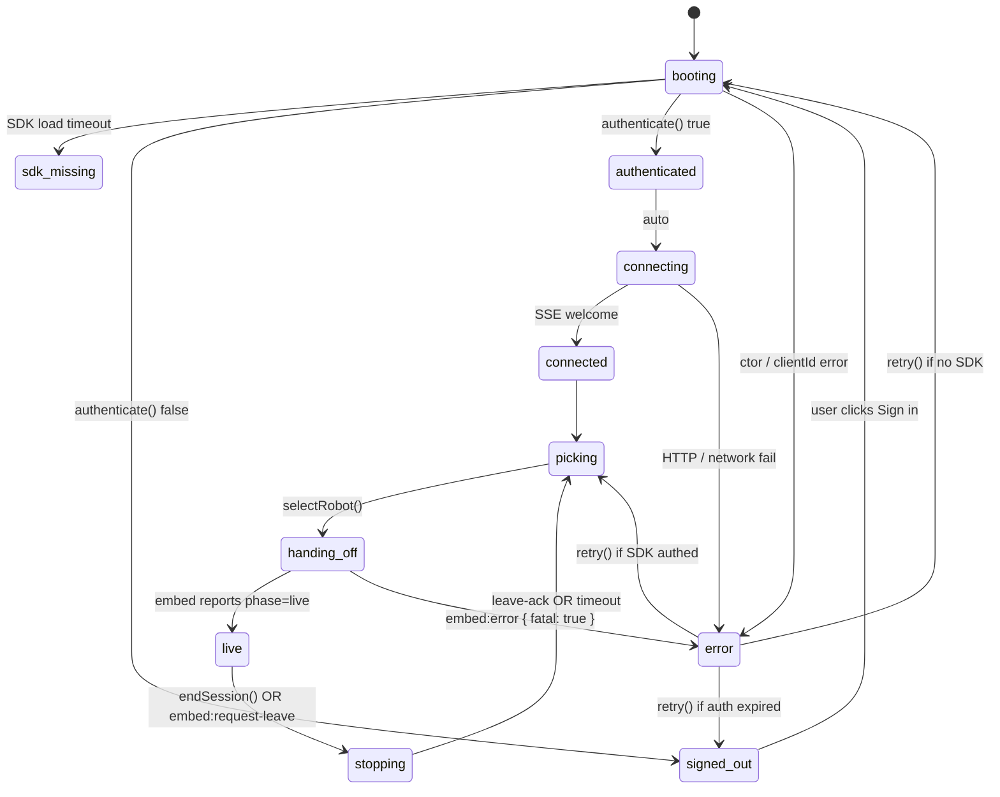
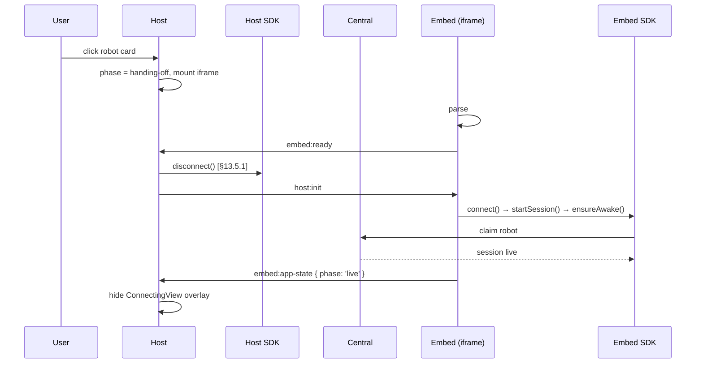

# App Creation Guide

> ### Use `@pollen-robotics/reachy-mini-sdk@1.8.0-rc1` today
>
> Every reference app currently pins the same SDK release line:
> **`1.8.0-rc1`** (precisely `1.8.0-rc1-main.fd4354c`). The host shell,
> the embed adapter, the SDK runtime, and the daemon on the robot
> are validated end-to-end against that build. Mixing versions
> across these boundaries causes silent protocol drift - see
> [§10 SDK version pinning](#10-sdk-version-pinning).
>
> Add this to your `package.json`:
>
> ```json
> { "dependencies": { "@pollen-robotics/reachy-mini-sdk": "1.8.0-rc1-main.fd4354c" } }
> ```

**This is the single source of truth for building a Reachy Mini JS
app.** [`../AGENTS.md`](../AGENTS.md) at the repo root points here;
the JS SDK reference at [`../docs/source/SDK/javascript-sdk.md`](../docs/source/SDK/javascript-sdk.md)
documents the runtime API (motion, events, daemon-side playback) once
`connectToHost()` resolves. Everything else - scaffolding, deploy,
host shell, gotchas - lives here.

How to ship a Hugging Face Space that runs on a Reachy Mini robot,
using `@pollen-robotics/reachy-mini-sdk/host` for OAuth, robot picking, session
lifecycle, and a top bar - so your code stays focused on **your
app's UI** and nothing else.

| Doc        | Purpose                              | Audience                          |
|------------|--------------------------------------|-----------------------------------|
| **This**   | **Single source of truth for app authors** (scaffold, deploy, host contract, invariants) | **You, building a new app**       |
| [`../docs/source/SDK/javascript-sdk.md`](../docs/source/SDK/javascript-sdk.md) | Runtime SDK API reference (methods, events, state machine, daemon-side playback) | App authors after `connectToHost()` resolves |
| [`host/README.md`](./host/README.md) | One-page tour of the `@pollen-robotics/reachy-mini-sdk/host` package layout | First-time visitors to the host source |

## Table of contents

1. [What you get for free](#1-what-you-get-for-free)
2. [Quickstart: clone a reference app](#2-quickstart-clone-a-reference-app)
3. [The app-author contract](#3-the-app-author-contract)
4. [`mountHost()` API](#4-mounthost-api)
5. [`connectToHost()` API](#5-connecttohost-api)
6. [Visual identity: icon, name, emoji](#6-visual-identity-icon-name-emoji)
7. [Receiving an external config (deep-link, mobile)](#7-receiving-an-external-config)
8. [Cleaning up on leave](#8-cleaning-up-on-leave)
9. [Local dev: HF token vs OAuth redirect](#9-local-dev)
10. [SDK version pinning](#10-sdk-version-pinning)
11. [Deploying to Hugging Face Spaces](#11-deploying-to-hugging-face-spaces)
12. [FAQ and common pitfalls](#12-faq-and-common-pitfalls)
13. [Architecture reference (host ↔ embed contract)](#13-architecture-reference-host--embed-contract)
    1. [Roles: app · host · embed](#131-roles-app--host--embed)
    2. [App identity & official apps](#132-app-identity--official-apps)
    3. [Two boot modes, one URL surface](#133-two-boot-modes-one-url-surface)
    4. [Host phase state machine + handoff sequence](#134-host-phase-state-machine--handoff-sequence)
    5. [Engineering invariants](#135-engineering-invariants)
    6. [Protocol v1 messages](#136-protocol-v1-messages)
    7. [Non-goals](#137-non-goals)
    8. [Threat model](#138-threat-model)

---

## 1. What you get for free

By integrating `@pollen-robotics/reachy-mini-sdk/host`, your app **does not have to
write**:

- **Hugging Face OAuth**: sign-in screen, redirect handling,
  token storage, sign-out menu - all in the host shell.
- **Robot discovery and picker**: list of online robots, live
  online/offline/busy updates, click-to-pick.
- **Connection overlay**: the 3-step "Connecting / Starting
  session / Waking up" view rendered on top of your iframe.
- **End-session button and tear-down**: a "Back to apps" affordance
  in the top bar that cleanly closes the WebRTC session.
- **Dark / light theme switching**: respected from
  `prefers-color-scheme` or HF settings, propagated to your iframe.

What **you** write:

- `index.html` (~30 lines of theme bootstrap + OAuth placeholders).
- `src/dispatch.ts` (~20 lines, picks shell vs embed mode and self-
  assigns `window.ReachyMini`).
- `src/embed.{ts,tsx}` - **your app's actual code**. You receive a
  live `ReachyMini` SDK handle and render whatever you want.
- `public/icon.svg` - one SVG that powers the top bar, the mobile
  catalog tile, and the favicon.

You can use **any framework** inside your `embed` entry: React,
Svelte, Vue, vanilla TS. The host runs outside your iframe and
doesn't care.

---

## 2. Quickstart: clone a reference app

Pick the reference closest to your needs and clone its repo from Hugging Face:

| Reference app                       | Stack                       | Use it for                                  |
|-------------------------------------|-----------------------------|---------------------------------------------|
| [`pollen-robotics/reachy_mini_minimal_conversation`](https://huggingface.co/spaces/pollen-robotics/reachy_mini_minimal_conversation) | **Vanilla TS + Vite**       | Smallest runtime, no framework              |
| [`pollen-robotics/reachy_mini_emotions`](https://huggingface.co/spaces/pollen-robotics/reachy_mini_emotions)                         | React 19 + MUI 7 + Vite     | UI-rich app with rich components / theming  |
| [`pollen-robotics/reachy_mini_telepresence`](https://huggingface.co/spaces/pollen-robotics/reachy_mini_telepresence)                 | React 19 + MUI 7 + Vite     | App with camera / media streams             |

```bash
# Example: start from the vanilla TS template
git clone https://huggingface.co/spaces/pollen-robotics/reachy_mini_minimal_conversation my_new_app
cd my_new_app
# Edit package.json `name`, README frontmatter (`title`, `emoji`,
# `short_description`), public/icon.svg, and src/embed.ts to your app.
npm install
npm run dev
# → http://localhost:5173
```

All three reference apps pin `@pollen-robotics/reachy-mini-sdk` to
the same RC version in their `package.json` - see [§10 SDK version pinning](#10-sdk-version-pinning).

---

## 3. The app-author contract

Exactly **three source files** are the entire integration surface,
plus `public/icon.svg`, a `package.json` (for the Vite build + the
SDK npm dep), and the Space `README.md` frontmatter
(see [§11 Deploying](#11-deploying-to-hugging-face-spaces)).

Don't add mandatory files outside this list - keep apps
interchangeable.

### 3.1 `index.html`

The reference apps' `index.html` no longer loads the SDK from a CDN
`<script>` tag - `src/dispatch.ts` imports the SDK from npm and self-
assigns `window.ReachyMini` before any host code runs. This removes
the jsDelivr branch / cache-purge friction we used to live with.

```html
<!doctype html>
<html lang="en">
  <head>
    <meta charset="UTF-8" />
    <meta name="viewport" content="width=device-width, initial-scale=1.0, viewport-fit=cover" />
    <title>My App</title>
    <link rel="icon" href="/icon.svg" type="image/svg+xml" />

    <!-- Theme bootstrap: paints the right palette BEFORE CSS lands so
         there's no flash. Priority: `?theme=dark|light` query param
         (set by the host when iframing us), then `prefers-color-scheme`. -->
    <script>
      (function () {
        try {
          var params = new URLSearchParams(window.location.search);
          var raw = params.get("theme");
          var mode;
          if (raw === "dark" || raw === "light") {
            mode = raw;
          } else if (window.matchMedia && window.matchMedia("(prefers-color-scheme: dark)").matches === false) {
            mode = "light";
          } else {
            mode = "dark";
          }
          document.documentElement.setAttribute("data-theme", mode);
        } catch (_) {
          document.documentElement.setAttribute("data-theme", "dark");
        }
      })();
    </script>

    <!-- HF Spaces helper variables.
         - In production, HF substitutes these placeholders at file-
           serve time when `hf_oauth: true` is set on the Space.
         - In `npm run dev`, placeholders stay untouched; we detect
           that and drop `window.huggingface` so the SDK falls back to
           the clientId you supplied via `mountHost({ clientId })`. -->
    <script>
      (function () {
        var clientId = "__OAUTH_CLIENT_ID__";
        var scopes = "__OAUTH_SCOPES__";
        var spaceHost = "__SPACE_HOST__";
        var spaceId = "__SPACE_ID__";
        var looksSubstituted = clientId && clientId.indexOf("__") !== 0;
        if (looksSubstituted) {
          window.huggingface = window.huggingface || {};
          window.huggingface.variables = {
            OAUTH_CLIENT_ID: clientId,
            OAUTH_SCOPES: scopes && scopes.indexOf("__") !== 0 ? scopes : "openid profile",
            SPACE_HOST: spaceHost && spaceHost.indexOf("__") !== 0 ? spaceHost : "",
            SPACE_ID: spaceId && spaceId.indexOf("__") !== 0 ? spaceId : "",
          };
        }
      })();
    </script>
  </head>
  <body>
    <div id="root"></div>
    <!-- Single dispatcher. Picks the host shell (standalone visit) or
         the embedded app (host's iframe) based on `?embedded=1`. -->
    <script type="module" src="/src/dispatch.ts"></script>
  </body>
</html>
```

### 3.2 `src/dispatch.ts`

The dispatcher does three things, in order:

1. Imports `ReachyMini` from npm and self-assigns `window.ReachyMini` -
   both the host shell and the embed wait for that global.
2. Dispatches a `reachymini:ready` event so the embed's wait loop
   takes its fast path.
3. Branches on `?embedded=1` (legacy alias `?embed=1` also accepted):
   embed bundle vs host shell bundle.

```ts
import { ReachyMini } from "@pollen-robotics/reachy-mini-sdk";

(window as unknown as { ReachyMini: typeof ReachyMini }).ReachyMini = ReachyMini;
window.dispatchEvent(new Event("reachymini:ready"));

const params = new URLSearchParams(window.location.search);
const isEmbed =
  params.get("embedded") === "1" || params.get("embed") === "1";

if (isEmbed) {
  void import("./embed");
} else {
  void import("@pollen-robotics/reachy-mini-sdk/host/auto").then(({ mountHost }) => {
    mountHost({
      appName: "My App",
      appIconUrl: "/icon.svg",
      appEmoji: "🤖",
      enableMicrophone: false,
      // Optional: forward dev shortcuts from .env.local. See §9.
      devToken:
        import.meta.env.VITE_HF_TOKEN && import.meta.env.VITE_HF_USERNAME
          ? {
              token: import.meta.env.VITE_HF_TOKEN as string,
              userName: import.meta.env.VITE_HF_USERNAME as string,
            }
          : undefined,
      clientId: import.meta.env.VITE_HF_OAUTH_CLIENT_ID as string | undefined,
    });
  });
}
```

### 3.3 `src/embed.ts` (vanilla example)

```ts
import { connectToHost } from '@pollen-robotics/reachy-mini-sdk/host/embed';

interface MyConfig {
  startingEmotion?: string;
}

async function main() {
  const handle = await connectToHost<MyConfig>();
  const { reachy, theme, config, onLeave } = handle;

  document.body.innerHTML = '<h1>Connected!</h1>';

  reachy.setHeadRpyDeg(0, 10, 0);

  onLeave(async () => {
    document.body.innerHTML = '<p>Bye!</p>';
  });
}

void main().catch((err) => {
  console.error('[my-app] boot failed', err);
  window.parent.postMessage(
    { source: 'reachy-mini', type: 'embed:error', version: 1,
      message: String(err), fatal: true },
    window.location.origin,
  );
});
```

### 3.4 `public/icon.svg`

A single 24×24-friendly SVG at `public/icon.svg` powers **all three**
identity surfaces (host top bar, mobile catalog tile, browser
favicon). See [§6 Visual identity](#6-visual-identity-icon-name-emoji)
for the resolution path and PNG fallback notes.

### 3.5 `package.json`

`npm`-managed; only mandatory bits are the Vite build script and the
SDK pin. See [§10 SDK version pinning](#10-sdk-version-pinning) for
the exact version string.

---

## 4. `mountHost()` API

Called once from `dispatch.ts` when the URL is **not** in embed mode.
Renders the shell into `#root`. The shell's visual theme (MUI
light/dark) is bundled and not overridable - the host owns its
look, apps own theirs inside the iframe.

```ts
import { mountHost } from '@pollen-robotics/reachy-mini-sdk/host/auto';

mountHost({
  appName: 'My App',          // REQUIRED: passed to the SDK + shown in top bar
  appIconUrl: '/icon.svg',    // optional: top-bar logo (see §6)
  appEmoji: '🤖',             // optional: fallback when no icon.svg
  enableMicrophone: false,    // false unless you need WebRTC audio in
  clientId: undefined,        // optional: HF OAuth client ID; defaults to window.huggingface.variables.OAUTH_CLIENT_ID
  devToken: undefined,        // optional: { token, userName } - dev shortcut, see §9
  target: undefined,          // optional: HTMLElement | string CSS selector; default '#root'
});
```

**Required**: `appName`. Everything else has sensible defaults.

**Return**: `{ dispose(): void }` - call to unmount cleanly. You
usually never need this; the page lifecycle handles it.

---

## 5. `connectToHost()` API

Called once from `embed.{ts,tsx}` to get a live SDK handle.

```ts
import { connectToHost } from '@pollen-robotics/reachy-mini-sdk/host/embed';

interface MyConfig { /* whatever your app accepts */ }

const handle = await connectToHost<MyConfig>();
```

Awaiting `connectToHost()` blocks until:

1. The URL hash creds are parsed and wiped.
2. The SDK script loaded (`window.ReachyMini` ready).
3. The host posted `host:init` (Mode A only; Mode B times out
   after 8 s and proceeds from hash alone).
4. The SDK connected, started a session, and woke the robot.

The resolved `handle` exposes:

```ts
interface ConnectedHandle<TConfig> {
  // Live state at boot
  reachy: ReachyMiniInstance;        // SDK instance, session live, robot awake
  theme: 'dark' | 'light';
  config: TConfig | null;
  appName: string;
  hostName: string;
  userName: string | null;

  // Subscribe to live updates from the host (returns an unsub fn)
  onLeave(cb: () => void | Promise<void>): () => void;
  onThemeChange(cb: (theme: 'dark' | 'light') => void): () => void;
  onConfigChange(cb: (config: TConfig | null) => void): () => void;

  // Push state / requests back to the host
  setAppState(s: { phase, connectingStep?, message? }): void;
  requestLeave(): void;                                      // ask host to end the session
  reportError(msg: string, opts?: { fatal?, detail? }): void;
}
```

The API is intentionally minimal. If you need a custom channel
between host and embed, file a feature request - we'll add it as
a typed message rather than expose a free-form sink.

### Typing your config

`connectToHost<T>()` types the `config` field; runtime validation
is **your job**. An attacker controlling the URL can shape config
freely - cast is not enough.

```ts
const handle = await connectToHost<MyConfig>();
const config = isValidConfig(handle.config) ? handle.config : null;
```

---

## 6. Visual identity: icon, name, emoji

> **App identity is your HF Space ID** (`owner/space`). An app
> published at `huggingface.co/spaces/your-name/cool-thing` has
> identity `your-name/cool-thing` everywhere downstream (mobile
> catalog, "last opened", official badge). Apps in the
> `pollen-robotics/*` namespace are automatically tagged as
> official in the catalog; no extra config.

Your app's identity surfaces in **three independent places**, all
fed from the same sources but each by its own resolution path:

| Surface                       | What it shows                          | How it gets there                                                                                  |
|-------------------------------|----------------------------------------|----------------------------------------------------------------------------------------------------|
| Host top bar (in your iframe) | App logo + app name                    | You pass `appName` + `appIconUrl` + `appEmoji` to `mountHost()` in `dispatch.ts`                   |
| Hugging Face mobile catalog   | App tile (icon + title + description)  | The mobile reads the catalog API; the API reads HF Spaces' frontmatter + probes `public/icon.svg` |
| Browser tab / OS              | Favicon                                | Your `index.html` `<link rel="icon" href="/icon.svg">`                                             |

The host shell itself **does not discover or list other apps**.
It renders only the app it lives in. The catalog is owned by the
mobile and the website API; see §11 FAQ for the API spec if you
need to validate your app shows up.

### Single source of truth: one `icon.svg`, one Space frontmatter

You ship **one** SVG file and **one** README frontmatter; both
the host and the mobile catalog read from them:

1. **`public/icon.svg`** in your repo. Vite copies it verbatim to
   `dist/icon.svg`, where nginx serves it at the root URL of your
   Space. Reference it from `index.html`:

   ```html
   <link rel="icon" href="/icon.svg" type="image/svg+xml" />
   ```

   Pass it to `mountHost()` so the top bar renders it without a
   probe:

   ```ts
   mountHost({ appName: 'My App', appIconUrl: '/icon.svg' });
   ```

   The catalog API also picks it up by listing the Space's
   files (`siblings`) and matching `public/icon.svg` (or
   `public/icon.png`), no live probe required.

2. **HF Space frontmatter** in your `README.md`:

   ```yaml
   ---
   title: My App
   emoji: 🤖
   colorFrom: yellow
   colorTo: red
   sdk: static
   pinned: false
   hf_oauth: true
   short_description: One-line description shown in the catalog.
   tags:
     - reachy_mini
     - reachy_mini_js_app
   ---
   ```

   See [§11.1](#111-required-frontmatter) for the full annotated
   frontmatter.

   - `title` is the app name in the mobile catalog (the in-iframe
     top bar uses `appName` from `mountHost()` instead).
   - `emoji` is the fallback logo when no `icon.svg` is shipped.
     Pass the same value to `mountHost({ appEmoji: '🤖' })` so the
     top bar's fallback matches.
   - `short_description` shows under the app tile in the catalog.
   - The **`reachy_mini_js_app` tag is mandatory** to appear in
     the mobile catalog. The catalog API filters on this exact
     string. Don't remove it.
   - `hf_oauth: true` makes HF auto-provision an OAuth client and
     inject the ID at file-serve time.

### Icon design recommendations

Your icon renders at three different sizes; design for all three:

- **Host top bar inside the iframe**: ~24x24 px square.
- **Mobile catalog tile**: ~64x64 px square card.
- **Browser tab favicon**: 16x16 px.

Practical guidance:

- Use a **square viewBox** (e.g. `viewBox="0 0 24 24"`) so the
  three target sizes all crop identically.
- Keep the icon **readable at 16 px**: thick strokes, simple
  silhouette, max 2-3 distinct shapes.
- Inline all colours; **don't reference external CSS**, the icon
  is served standalone.
- Respect dark and light backgrounds: an icon that vanishes on
  light should provide a `<style>` tag with `@media (prefers-color-scheme)`
  rules or, simpler, use a neutral mid-tone palette.
- **Optimise the SVG**: target ~30 KB or less. Tools: `svgo`,
  Figma's "Export SVG → optimise".

### PNG fallback

If you can't ship SVG (heavy raster art, exported portrait, ...),
the catalog API also accepts `public/icon.png`. SVG wins when both
exist. The host top bar only renders the SVG variant - if your
`mountHost({ appIconUrl })` points at a PNG, it works, but you
lose the crisp upscale on hi-DPI screens.

---

## 7. Receiving an external config

The host accepts a base64-encoded JSON `config` from two sources:

1. **URL parameter**: `https://<space>.hf.space/?config=eyJlbW90aW9uIjoiam95In0=`
   (decoded once, passed verbatim).
2. **Mobile handoff**: the mobile app embeds your Space with
   `?embedded=1#creds=<base64-bundle-including-config>`.

Your app receives `config` typed as `unknown`; cast and validate.

```ts
interface MyConfig { startingEmotion?: string; }

function isMyConfig(v: unknown): v is MyConfig {
  return v != null && typeof v === 'object' && (
    (v as MyConfig).startingEmotion === undefined ||
    typeof (v as MyConfig).startingEmotion === 'string'
  );
}

const handle = await connectToHost<MyConfig>();
const initial: MyConfig = isMyConfig(handle.config) ? handle.config : {};

handle.onConfigChange((next) => {
  if (isMyConfig(next)) /* react to it */;
});
```

If your app's UI state changes in a way the mobile would want to
remember (e.g. user picked a different emotion), persist it in
your app's storage. The host does **not** propagate state
upstream - apps don't push config to the host in v1.

---

## 8. Cleaning up on leave

The host fires a tear-down sequence in three scenarios:

- User clicks "End session" / "Back to apps" in the top bar.
- Your app calls `handle.requestLeave()`.
- The page is unloaded (`pagehide`, e.g. user closes the tab).

In all three cases your `onLeave` callbacks fire. You have **~1.5-2 s**
before the host force-unmounts the iframe; use that to:

```ts
handle.onLeave(async () => {
  player.cancel();        // stop streaming motion frames
  audioCtx?.close();      // release audio
  ws?.close();            // close any side channels
  await flushTelemetry(); // your async hooks
});
```

You do **not** need to call `reachy.stopSession()` yourself - the
host does. You also don't need to navigate away; the iframe is
unmounted by the host.

---

## 9. Local dev

You have two options, picked by the `devToken` and `clientId`
props passed to `mountHost()`. Reference apps support both via
`.env.local`.

### Option A: personal access token (no OAuth)

Fastest for local dev. Skips the OAuth redirect entirely.

1. Get a token at <https://huggingface.co/settings/tokens> (read
   scope is enough).
2. Create `.env.local`:

   ```
   VITE_HF_TOKEN=hf_xxx
   VITE_HF_USERNAME=your-handle
   ```

3. In `dispatch.ts`, forward both to `mountHost`:

   ```ts
   mountHost({
     appName: 'My App',
     devToken: import.meta.env.VITE_HF_TOKEN && import.meta.env.VITE_HF_USERNAME
       ? { token: import.meta.env.VITE_HF_TOKEN, userName: import.meta.env.VITE_HF_USERNAME }
       : undefined,
   });
   ```

4. `npm run dev` → you're signed in on page load.

`.env.local` must be gitignored. **Never commit the token.**

### Option B: real OAuth client ID

Use this when you're touching the OAuth / logout paths.

1. Go to <https://huggingface.co/settings/applications/new>.
2. Homepage URL: `http://localhost:5173` · Redirect URIs:
   `http://localhost:5173` · Scopes: at least `openid`, `profile`.
3. Copy the client ID into `.env.local`:

   ```
   VITE_HF_OAUTH_CLIENT_ID=...
   ```

4. Forward to `mountHost`:

   ```ts
   mountHost({
     appName: 'My App',
     clientId: import.meta.env.VITE_HF_OAUTH_CLIENT_ID,
   });
   ```

---

## 10. SDK version pinning

Every reference app pins the same exact SDK version in `package.json`.
Pin yours the same way - mixing versions across `@pollen-robotics/reachy-mini-sdk`,
`@pollen-robotics/reachy-mini-sdk/host`, and the daemon on the robot
produces hard-to-debug protocol drift.

The current pinned version across all three reference apps:

```json
{
  "dependencies": {
    "@pollen-robotics/reachy-mini-sdk": "1.8.0-rc1-main.fd4354c"
  }
}
```

This is the `1.8.0-rc1` release line, with the `-main.fd4354c` suffix
identifying the commit-tagged prerelease build that's been validated
end-to-end against the host shell + daemon. **Use the same string in
your `package.json`** unless you're explicitly tracking a newer RC.

> When a newer RC is published, the source of truth is whichever
> string is currently shared by [`reachy_mini_minimal_conversation`'s
> `package.json`](https://huggingface.co/spaces/pollen-robotics/reachy_mini_minimal_conversation/blob/main/package.json),
> [`reachy_mini_emotions`'s `package.json`](https://huggingface.co/spaces/pollen-robotics/reachy_mini_emotions/blob/main/package.json),
> and [`reachy_mini_telepresence`'s `package.json`](https://huggingface.co/spaces/pollen-robotics/reachy_mini_telepresence/blob/main/package.json).
> If those three diverge, fall back to whatever this guide says.

### Why pin a specific build (not `^1.8.0` or a major like `@1`)?

The host shell, the embed adapter (`connectToHost`), the SDK, and the
robot daemon negotiate over a versioned WebRTC data-channel protocol.
A patch bump on one side that crosses a protocol boundary will
silently fall back (or noisily fail) at runtime - well past the type
checker.

Pin to the exact build string the reference apps use, upgrade
intentionally, and re-test against a live robot before shipping.

---

## 11. Deploying to Hugging Face Spaces

> Reachy Mini JS apps ship as **`sdk: static`** Hugging Face Spaces.
> HF serves the Vite build straight from its CDN and replaces
> `__OAUTH_CLIENT_ID__` and friends at file-serve time, because
> `hf_oauth: true` is set in the README frontmatter.

### 11.1 Required frontmatter

```yaml
---
title: My Reachy Mini App
emoji: 🤖
colorFrom: yellow
colorTo: red
sdk: static
pinned: false
hf_oauth: true
short_description: One-line description shown in the mobile catalog.
tags:
  - reachy_mini
  - reachy_mini_js_app   # mandatory: mobile-catalog discovery filters on this exact string
---
```

- `sdk: static` is what makes HF serve your `dist/` from its CDN.
- `hf_oauth: true` is what triggers `__OAUTH_CLIENT_ID__` substitution.
- The **`reachy_mini_js_app` tag is mandatory** for mobile-catalog
  discovery. The catalog API filters on this exact string.
- Apps in the `pollen-robotics/*` namespace are automatically tagged
  as "official" in the catalog (see [§13.2 App identity & official apps](#132-app-identity--official-apps)); no extra config.

### 11.2 Build and push

```bash
# 1. Build locally
npm install
npm run build
# → dist/  (contains index.html with the __OAUTH_CLIENT_ID__ placeholder
#    intact, your bundled JS, and dist/icon.svg copied from public/)

# 2. Create the Space and clone it next to your source tree
hf repos create <app-name> --repo-type space --space-sdk static
git clone https://huggingface.co/spaces/<username>/<app-name> ../<app-name>-space

# 3. Stage the Space contents:
#    - README.md (the frontmatter)
#    - dist/...  (served at the Space root by HF's CDN)
#    - public/icon.svg duplicated at the repo path the mobile catalog
#      API matches (HF's `siblings` listing only sees committed files,
#      not the Vite-emitted dist/icon.svg).
cp README.md ../<app-name>-space/
cp -R dist/. ../<app-name>-space/
mkdir -p ../<app-name>-space/public
cp public/icon.svg ../<app-name>-space/public/
# (also cp public/icon.png if you ship a raster fallback)

# 4. Push
cd ../<app-name>-space
git add -A && git commit -m "Initial deploy" && git push
```

### 11.3 What HF does at serve time

- Substitutes `__OAUTH_CLIENT_ID__`, `__OAUTH_SCOPES__`,
  `__SPACE_HOST__`, and `__SPACE_ID__` inside any `.html` file at the
  Space root (because `hf_oauth: true`).
- Serves the rest of `dist/` as static assets via its CDN (immutable
  caching honours the hashed filenames Vite emits).
- Indexes `siblings` for the mobile catalog probe (which is why you
  need `public/icon.svg` committed at the repo path, not just inside
  `dist/`).

### 11.4 Cache busting

If a push doesn't take effect, push an empty commit to force HF to
re-resolve the Space:

```bash
git commit --allow-empty -m "chore: bust HF Spaces cache" && git push
```

---

## 12. FAQ and common pitfalls

### "I see a `Robot is busy` error even though no one is using the robot"

The host's SDK and the embed's SDK both claim a peer at the
central. The host **must** disconnect when the embed boots; if it
doesn't, the central sees two peers with the same `appName` and
rejects the embed.

This is handled automatically by `@pollen-robotics/reachy-mini-sdk/host`
(see [§13.5.1 Single live SDK per tab](#1351-single-live-sdk-per-tab)).
If you see this in dev, you likely have **two tabs** open on the
same Space - that's expected behaviour.

### "My app loads React + MUI even though I wrote vanilla TS"

The **host shell** is React + MUI. It runs **only outside your
iframe** (sign-in screen, picker, top bar). Once your app is live,
the host's React tree is idle.

Your iframe content is whatever you wrote. Vanilla TS apps stay
slim inside the iframe.

### "Vite warns about React being installed in two places"

You're using the legacy `file:./vendor/reachy-mini-host` dep
pattern (now unsupported — the host ships from npm as part of
`@pollen-robotics/reachy-mini-sdk`). Migrate to the npm dep and,
if you still see the warning, add to your `vite.config.ts`:

```ts
export default defineConfig({
  resolve: {
    dedupe: ['react', 'react-dom', 'react/jsx-runtime',
             '@emotion/react', '@emotion/styled',
             '@mui/material', '@mui/icons-material'],
  },
  optimizeDeps: {
    include: ['@pollen-robotics/reachy-mini-sdk',
              '@pollen-robotics/reachy-mini-sdk/host',
              '@pollen-robotics/reachy-mini-sdk/host/auto',
              '@pollen-robotics/reachy-mini-sdk/host/embed'],
  },
});
```

### "I want a different sign-in flow"

Not supported in v1. The host owns OAuth. If you need a custom
flow, the standalone shell isn't for you - publish your Space
with the host disabled (just don't call `mountHost()`) and roll
your own.

### "I want a different theme than the bundled MUI one"

The host shell's look is fixed (light + dark MUI bundle). Apps
own their own theme **inside the iframe** - use the
`handle.theme` value as your mode signal and wrap your app in
whatever ThemeProvider you want.

```ts
const handle = await connectToHost();
// Mirror `handle.theme` ('dark' | 'light') in your own
// ThemeProvider. The host pushes updates via onThemeChange().
```

### "The icon doesn't show up in the top bar"

Check the three sources in priority order (§6):

1. Is `/icon.svg` reachable at the deployed URL? Open
   `https://<space>.hf.space/icon.svg` directly.
2. Is the file's MIME type `image/svg+xml`? The host's probe
   checks the response's `content-type`.
3. Did you pass `appIconUrl: '/icon.svg'` to `mountHost()`?

If 1 + 2 + 3 are correct and it still fails, file a bug.

### "My Space serves the bundle but the OAuth login redirects loop"

HF only substitutes `__OAUTH_CLIENT_ID__` when `hf_oauth: true` is
set in the README frontmatter **and** the file is HTML. Common
mistakes:

- `hf_oauth: true` missing → placeholder stays as literal
  `"__OAUTH_CLIENT_ID__"`; the SDK falls back to no client ID and
  the login never resolves.
- You pushed a built `dist/index.html` that already had the
  placeholder replaced locally (e.g. you ran with `.env.local` and
  some bundler hardcoded the value). HF only substitutes
  `__...__` literals; if the file already has a real ID baked in
  for a different OAuth client, the redirect targets the wrong app.
- The Space pre-dates the `hf_oauth` substitution (very old
  Spaces). Re-create the Space.

### "My app doesn't appear in the mobile catalog"

Three things must be true simultaneously:

1. The Space tags include the exact string `reachy_mini_js_app` (see
   the [§11.1 frontmatter](#111-required-frontmatter)).
2. `public/icon.svg` exists in the **committed repo tree** (not just
   in `dist/`). The catalog probe inspects `siblings`, which is a
   listing of committed files, not served URLs.
3. The Space is public (or the requesting user has access).

### "Where do I see if my app crashed at boot?"

Three places, in order:

1. Browser console of the standalone Space tab (mountHost errors).
2. Browser console of the iframe (embed errors). The embed
   `postMessage`s any boot error back to the host as
   `embed:error` - the host surfaces fatal ones via a banner.
3. HF Space "Logs" tab - only build-time errors show up here for
   static Spaces (no runtime container).

### "How do I test the mobile-handoff mode locally?"

Hit your dev server at:

```
http://localhost:5173/?embedded=1#creds=<base64({"hfToken":"hf_xxx","userName":"you","robotPeerId":"abc","signalingUrl":"https://...","theme":"dark","config":null,"hostName":"Reachy Mini","appName":"My App"})>
```

The dispatcher will skip the shell and go straight to your embed.
Useful for testing the embed path without spinning up the mobile
app. The exact bundle shape is documented at
[§13.3 Two boot modes](#133-two-boot-modes-one-url-surface).

---

## 13. Architecture reference (host ↔ embed contract)

> **You don't need this section to ship an app.** §1-§12 above are
> enough. This appendix is the canonical contract between the **app**,
> the **host shell**, and the **embed adapter** - useful when you're
> debugging a weird boot, considering an unusual deployment, or
> contributing to the host shell itself.

### 13.1 Roles: app · host · embed

Three actors, one app repository:

| Actor      | Lives in                                              | Owns                                                                       |
|------------|-------------------------------------------------------|----------------------------------------------------------------------------|
| **App**    | `index.html` + `src/dispatch.ts` + `src/embed.{ts,tsx}` | UI, app-specific UX, **full freedom over framework / tooling choices**     |
| **Host**   | `@pollen-robotics/reachy-mini-sdk/host/auto`          | OAuth, robot discovery, robot picker, connecting overlay, end-session flow |
| **Embed**  | `@pollen-robotics/reachy-mini-sdk/host/embed`         | SDK lifecycle inside the iframe (`startSession`, `ensureAwake`, teardown)  |

The **App** consumes the Reachy Mini SDK (imported in
`src/dispatch.ts` and self-assigned to `window.ReachyMini`) plus the
`@pollen-robotics/reachy-mini-sdk/host` subpath exports. It contains
**zero auth code, zero picker code, zero session-lifecycle code**.

#### Why React + MUI for the host shell (and only the host)

The host shell needs a real component library: sign-in forms, robot
picker lists, connecting overlays, top bar, dark-mode toggles. It's
built with **React 19 + MUI 7 + Emotion**.

- The shell renders **only outside your iframe** and only between
  sessions; once your app is live, the shell's React tree is idle.
- Apps written in another framework still load the shell's bundle
  for sign-in / picker UI. That's the cost of the iframe model and
  we accept it.

The trade-off favours **fast host iteration + tech freedom for
apps** over a slimmer host shell.

### 13.2 App identity & official apps

A Reachy Mini app is uniquely identified by its **Hugging Face Space
ID**, of the form `owner/space` (e.g. `pollen-robotics/emotions`).
Everything downstream of identity flows from this single string:

- The catalog API filters and dedupes apps by `space.id`.
- The mobile app stores and recalls "last opened" apps by
  `owner/space`.
- The host shell does **not** need this ID at runtime (it lives
  inside the app it renders); it's used solely by the discovery
  surface.

**An app is "official" if and only if its Space ID starts with
`pollen-robotics/`.** No allowlist, no separate registry, no
`official: true` field. Adding `pollen-robotics/` to your URL is the
entire qualification. Where the distinction surfaces:

| Surface                | Behaviour                                                       |
|------------------------|-----------------------------------------------------------------|
| Mobile catalog         | "Official" badge / sort priority on `pollen-robotics/*` Spaces  |
| Website `/api/js-apps` | Returns `isOfficial: true` for `pollen-robotics/*`              |
| Host shell             | **No notion of "official"**. Renders the app the same way always |

### 13.3 Two boot modes, one URL surface

The same `index.html` is served for both modes. The dispatcher
(`src/dispatch.ts`) picks between them based on the URL.

| Mode                  | URL shape                                                            | What happens                                         |
|-----------------------|----------------------------------------------------------------------|------------------------------------------------------|
| **A. Hub standalone** | `https://<space>.hf.space/`                                          | Full host shell (OAuth → picker → iframe with app)   |
| **B. Mobile handoff** | `https://<space>.hf.space/?embedded=1#creds=<base64(CredsBundle)>`   | Skip shell; app boots directly, creds come via hash  |

#### Dispatch rule

```
if (URL.searchParams.has("embedded") && URL.hash.startsWith("#creds=")):
    boot embed  → import("./embed")
else:
    boot host   → import("@pollen-robotics/reachy-mini-sdk/host/auto").mountHost({...})
```

`?embedded=1` without creds is an invalid mode - the embed shows an
`ErrorView`.

#### `CredsBundle` (lives only in the URL hash, never in search)

The bundle has the shape:

```ts
{
  hfToken: string;       // short-lived HF bearer (15 min TTL)
  userName: string;
  robotPeerId: string;
  signalingUrl: string;
  theme: 'dark' | 'light';
  config: unknown | null;
  hostName: string;
  appName: string;
}
```

The hash is **never sent to a server**. The embed wipes it with
`history.replaceState` on the very first synchronous tick of
`connectToHost()`, **before any `await`** - see
[§13.5.2 Hash-only creds + immediate wipe](#1352-hash-only-creds--immediate-wipe).

#### Mode A standalone flow (the long story)

Phase machine inside the host:

```
booting → (signed-out | authenticated) → connecting → connected →
picking → handing-off → live → stopping → picking
```

- `booting`: wait for `window.ReachyMini`, instantiate the SDK,
  call `authenticate()`.
- `signed-out`: render the OAuth sign-in screen.
- `authenticated` → `connecting` → `connected` (SSE welcome) →
  `picking`.
- During `picking`, the robot list reacts live to the SDK's
  `robotsChanged` event.
- On robot selection, the host mounts the iframe at
  `<same-origin>?embedded=1#creds=<base64>` and overlays
  `ConnectingView` (3-step stepper: `link` → `session` → `wake`).
- When the embed reaches `phase: 'live'`, the overlay fades out.

Top bar layout while `live`:

```
[icon] [app name] ........ [robot status] [end-session] [oauth menu]
```

The top bar stays rendered through every phase of Mode A and does
**not** render at all in Mode B.

End-session flow:

1. Triggered by the End-session button, `embed:request-leave`, or
   `pagehide`.
2. Host → phase `stopping`, `LeavingView` overlay, posts
   `host:leaving`.
3. Embed runs `onLeave` callbacks → `reachy.stopSession()` → acks.
4. Host receives ack (or hits `timeoutMs`) → unmounts iframe →
   phase `picking`.

#### Mode B mobile handoff flow

The mobile app opens the Space in a WebView with a pre-built URL
containing creds in the hash. The dispatcher loads `./embed`
directly. **No host shell is mounted.** The user sees:

- No sign-in view (mobile already authenticated).
- No robot picker (mobile already picked).
- No welcome-back animation.
- No host top bar - if your app wants one, it draws it itself.

There is **no end-session button** in Mode B. Closing the WebView
triggers `pagehide`, which fires `onLeave` and stops the session.

### 13.4 Host phase state machine + handoff sequence

#### Host phase machine (Mode A only)



#### Handoff sequence (host → embed)

Showcases the single-SDK-per-tab invariant
([§13.5.1](#1351-single-live-sdk-per-tab)).



### 13.5 Engineering invariants

Four hard invariants. A failure here is a regression in the host
shell - it must produce a defined observable behaviour and must
stay covered by tests.

#### 13.5.1 Single live SDK per tab

**Contract**: at any instant, exactly one SDK instance per tab is
registered at the central.

**Mechanism**:
- Host mounts the SDK in `booting` and uses it for the picker.
- As soon as the embed posts `embed:ready`, the host calls
  `disconnect()` on its SDK and zeroes its references.
- On `leave-ack` (or timeout), the host calls `connect()` again to
  refresh the fleet and lands back on `picking`.

**Why**: removes the entire class of "Robot is busy" false
positives where the central thinks the shell still owns the robot.

**Defence in depth**: the host's SDK registers as `<appName> (shell)`
at the central; the embed keeps the clean `appName`. This protects
the narrow window where both SDKs overlap (between `embed:ready`
and `disconnect()`).

#### 13.5.2 Hash-only creds + immediate wipe

**Contract**: HF tokens never appear in URL search, never in
referer, never in HF Spaces access logs.

**Mechanism**:
- Creds are serialised as base64 JSON in the URL hash fragment
  (`#creds=...`).
- The embed wipes the hash with `history.replaceState` on the
  first synchronous tick of `connectToHost()`, before any `await`.
- On `host:leaving`, the embed clears `sessionStorage.hf_*` keys
  before sending the `leave-ack`.

**Token TTL**: `hf_token_expires` is set to **15 min** at seed
time. The SDK refreshes on demand.

#### 13.5.3 Bundle and SDK pinning

**Contract**: a fix in the host reaches every Space within one
cache cycle, with no per-app rebuild. A fix in the SDK can be
rolled out by the SDK team, not by every app team.

**Pinning rules**:
- App bundles (`index-<hash>.js`): hashed by Vite, cache-busted
  on deploy.
- `@pollen-robotics/reachy-mini-sdk` in `package.json`: pinned to
  an **exact prerelease build** (today: `1.8.0-rc1-main.fd4354c`),
  not a range. See [§10 SDK version pinning](#10-sdk-version-pinning).
- `@pollen-robotics/reachy-mini-sdk/host` subpath imports: same
  pin, same package.

On detected mismatch (e.g. unknown protocol version, structurally
invalid `host:init`), the host's `ErrorView` primary button calls
`window.location.reload(true)` to bypass any intermediary cache.

#### 13.5.4 React Strict Mode safety

**Contract**: every effect in the host package survives a double
mount in `<React.StrictMode>` without doubling network I/O, SDK
instances, or postMessage traffic.

**Why this matters**: React 18+ in dev intentionally mounts every
component, runs every effect, runs every cleanup, then mounts and
runs effects again. Code that "looked fine" in prod will fire two
parallel `connect()` calls, leak two SSE subscribers, post
`embed:ready` twice. In Mode A this surfaces as ghost sessions at
the central; in Mode B as two competing WebRTC peer connections.

**Mechanisms**:
- **Boot guard refs**: `useReachyHost()` uses a `bootStartedRef`
  set on first mount; the second StrictMode invocation early-
  returns instead of re-instantiating the SDK.
- **Subscription cleanup**: every `useEffect` returns its tear-
  down. `robotsChanged`, `phaseChanged`, `welcome` are all
  unsubscribed in cleanup.
- **Idempotent SDK calls**: `connect()` is a no-op when the SDK is
  already `connected` / `streaming`; the host relies on this rather
  than gating with a flag.
- **`connectToHost()` is one-shot**: a module-level
  `bootPromiseRef` returns the same promise for a second call,
  rather than re-running the handshake.

### 13.6 Protocol v1 messages

Full type definitions in
[`ts/host/src/lib/protocol.ts`](./host/src/lib/protocol.ts).
Envelopes are JSON, carry `source: 'reachy-mini'` and `version: 1`.
Both sides validate `event.origin` against `window.location.origin`
before trusting the payload.

| Direction       | Type                          | Purpose                                       |
|-----------------|-------------------------------|-----------------------------------------------|
| embed → host    | `embed:ready`                 | "I'm alive, send creds"                       |
| host  → embed   | `host:init`                   | Theme, signaling URL, hfToken, robotPeerId, config |
| embed → host    | `embed:app-state`             | Lifecycle phase + connecting sub-step         |
| host  → embed   | `host:theme-changed`          | Theme switched (no reload)                    |
| host  → embed   | `host:config-changed`         | Config updated (no reload, mobile-driven)     |
| host  → embed   | `host:leaving`                | Tear-down request with `timeoutMs`            |
| embed → host    | `embed:request-leave`         | App requests end-of-session                   |
| embed → host    | `embed:error`                 | Error report (`{ message, fatal, detail? }`)  |

Intentionally **not** in the v1 protocol:

- `embed:request-config-update` (apps don't push config upstream).
- `host:custom` / `embed:custom` (no free-form channel; new needs
  land as typed messages via a major bump).
- Any heartbeat / ping-pong messages.

#### Versioning policy

- `version: 1` is the only version today.
- **Additive changes** (new optional field, new message type) ship
  without a version bump.
- **Breaking changes** (removed field, changed semantics, removed
  message type) bump to `version: 2`. The host MAY support both
  versions for one release cycle, then drop v1.
- On unknown version, the receiver logs a warning and ignores the
  message. No negotiation handshake.

#### Idempotency

- `host:leaving` may arrive twice; the embed runs `onLeave`
  callbacks **once** (gated by a `pendingLeaveTokenRef`) and acks
  every time.
- `host:init` may arrive twice (rare: bridge re-arm); the embed
  treats the latest as authoritative and re-applies theme / config.

### 13.7 Non-goals

To stay simple and auditable, the host shell explicitly does NOT do:

- **App discovery / listing / catalog**. The shell renders exactly
  **one** app: the one it ships with. Listing apps lives in the
  Reachy Mini mobile app, fed by the website's `/api/js-apps`
  endpoint (filtered on `reachy_mini_js_app`).
- **"Official app" badging in the shell**. Officialness is derived
  from the Space ID prefix and surfaces only in the mobile catalog.
- **Multi-robot per tab**. One robot at a time per Space session.
- **Hot reload of the app code without reloading the iframe**.
  Code updates require unmounting + remounting.
- **App ↔ app communication**. Apps are sandboxed by design.
- **Offline mode**. The central is required for every session.
- **Automatic WebRTC retry**. On a session drop, the user goes
  back to the picker manually.
- **Queue or persistence of postMessage events** if the bridge is
  down. The bridge is best-effort; both sides re-converge on the
  next message.
- **Server-side rendering**. The host is a CSR shell, deliberately.
- **Cross-origin iframe**. The embed is same-origin with the host
  (both served by the Space); the origin check relies on this.
- **Imposing a framework on app authors**. Apps inside the iframe
  are completely free of framework constraints.

### 13.8 Threat model

The host runs in a HF Spaces container; the embed runs in a
same-origin iframe within the same Space.

| Asset                    | Threat                                   | Mitigation                                     |
|--------------------------|------------------------------------------|------------------------------------------------|
| HF bearer token          | Leak via URL log / referer               | Hash-only + immediate wipe (§13.5.2), 15 min TTL |
| HF bearer token          | Leak via sessionStorage to other origin  | Same-origin embed, no cross-origin postMessage |
| `config` payload         | Attacker controls URL → malformed JSON   | App MUST validate at the boundary (typed cast is not enough) |
| postMessage channel      | Random extension posts a forged message  | Receivers check `source === 'reachy-mini'` AND `event.origin === window.location.origin` |
| Central session          | Tab crashes, robot stays claimed         | `pagehide` triggers `stopSession()`; central also enforces idle timeout |

**Out of scope** for this iteration:
- Defence against a malicious app that the user explicitly loaded.
  We trust apps published under the `pollen-robotics/*` namespace.
- Defence against a compromised central. The signaling URL is
  configurable per-Space; the central is the trust root.
